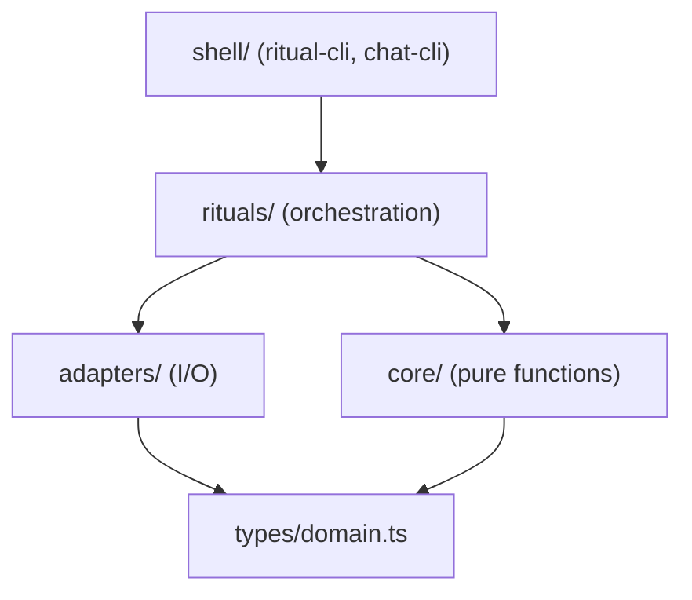
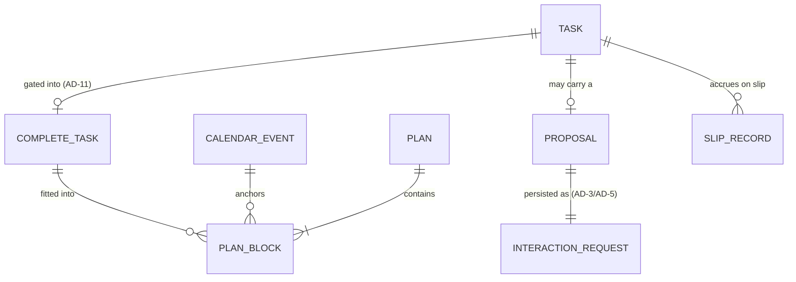
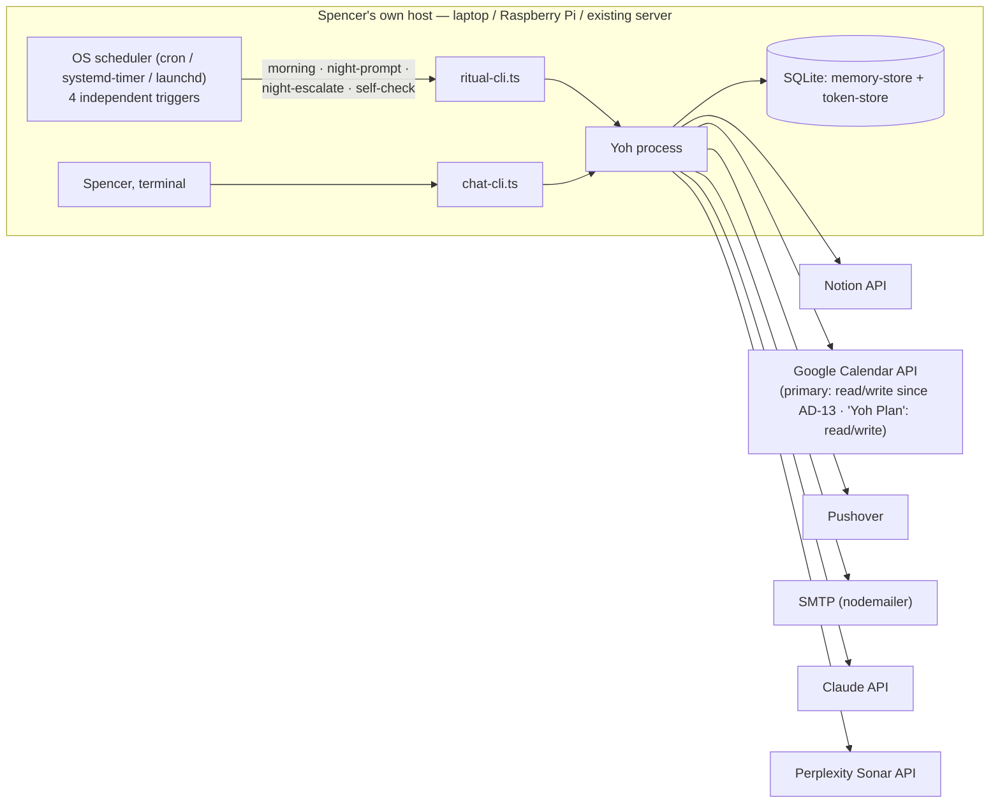

# Architecture Spine — Yoh

## Design Paradigm

**Functional Core / Imperative Shell.** Planning and ritual logic is a set of pure, stateless functions with no I/O and no shared state (`core/`); everything that touches the outside world — Notion, Google Calendar, Pushover, email, Claude, SQLite — lives in thin adapters (`adapters/`); orchestration (`rituals/`) wires core + adapters together per ritual; two CLI entry points (`shell/`) are the only way in. A function's typed signature is its contract — no ports/DI abstraction layer, since adapters here are swapped by phase (CLI now, web later), never at runtime.

This directly satisfies the PRD addendum's own architecture guidance ("keep planning/ritual logic decoupled from the CLI presentation layer, so Phase 2+ surfaces can call the same core logic instead of forking it") and the build-time constraint this spine was commissioned under: implementation tasks must be independent, file-owned, and expressed as explicit Consumes/Produces signatures rather than shared mutable state.

**Ritual output is never a blocking question.** Every ritual runs unattended and to completion, then exits. If it needs an answer from Spencer (a missing Task field, a close-out confirmation, a Self-Check score), it persists that need as an **open interaction request** and exits — it never holds the process open waiting. `chat-cli.ts` is the only place an open interaction request gets resolved, whenever Spencer next opens a session. This is the one addition the review pass forced into this section, because it changes what "ritual" means architecturally: a ritual is a state transition plus, optionally, a durable question — never a wait.

## Invariants & Rules



### AD-1 — Functional Core / Imperative Shell layering

- **Binds:** all
- **Prevents:** planning/ritual business logic entangling with I/O, or getting reimplemented per surface (CLI now, web/hardware/iOS later)
- **Rule:** dependency direction is strictly `shell → rituals → {core, adapters}`; `adapters → types` only. Files under `core/` may import only from `types/` and other `core/` files — never from `adapters/`, `rituals/`, or `shell/`. `[ADOPTED]`

### AD-2 — No shared mutable state across core functions

- **Binds:** `core/*`
- **Prevents:** two independently-built core functions each passing their own tests yet corrupting shared state when composed
- **Rule:** every `core/*.ts` file exports pure functions only — same inputs produce the same outputs, no reads/writes to module-level variables, no mutation of arguments. Prior state a function needs (yesterday's slip count, the last Self-Check score) is passed in as an explicit parameter, never fetched internally. `[ADOPTED]`

### AD-3 — Propose-Don't-Impose modeled as durable, versioned data

- **Binds:** FR-16 (learned pattern), FR-5 (Time Budget change suggestion), FR-25 (Data-Completeness Gate inferred field-value suggestion), FR-26 (Notion page/DB draft), FR-27 (Calendar time-block edit proposal — see AD-13 for the calendar-specific mechanics layered on top of this)
- **Does not bind:** FR-10. Rescheduling around a reported Blocker is unconditional and automatic — FR-10's own consequence text is explicit that Yoh "does not generate suggestions for resolving the underlying obstacle." The Glossary's Propose-Don't-Impose entry names "a Blocker resolution" as a confirmation-gated case, but Phase 1 has no code path that ever produces a Blocker-resolution suggestion to confirm — that clause describes a boundary that stays permanently unreached in this scope, not a gate FR-10's mechanical reschedule must pass through. **Also does not bind:** FR-29 (file search result to Research Vault) — see AD-12; FR-29 is modeled as direct-write, the same shape as FR-24, not a Proposal.
- **Prevents:** a learned pattern, suggested Time Budget change, or Phase 1.5 draft/proposal silently taking effect because "propose" and "apply" share one code path; a stale proposal being applied against state that has since moved on; a proposal generated during an unattended ritual run having no path back to Spencer.
- **Rule:** any function that would suggest a behavior or budget change, or draft a Notion item, calendar edit, or field value for Spencer's review, returns a `Proposal<T>` value (the suggested change, its reason, and a snapshot/version of the entity it would change) instead of performing it. `memory-store.ts` persists every open `Proposal` as an open interaction request. Only `chat-cli.ts`, after an explicit yes/no from Spencer, may act on it.
  - **`apply(proposal)` is a pattern name, not one literal shared signature.** Each concrete write function has its own calling convention, and `chat-cli.ts` calls each one directly — there is no single generic `apply(proposal: Proposal<unknown>)` dispatcher every write function conforms to. For FR-16/FR-5 (learned pattern, Time Budget) and FR-27 (`applyCalendarEdit`, AD-13), the function takes the `Proposal` itself, re-reads the live entity, and rejects with `YohError.kind: 'stale-proposal'` if its version no longer matches the snapshot. For FR-25/FR-26, `chat-cli.ts` extracts the confirmed `Proposal`'s payload (the suggested field value; the `NotionPageDraft`'s `database`/`properties`) and calls the adapter's plain write function directly (`updateTaskField`, `createPage`) — these functions take unwrapped arguments, are not named `apply*`, and pre-date this AD.
  - **The stale-proposal re-read does not apply to a `Proposal<T>` that creates a new entity rather than modifying an existing one** — currently, `Proposal<NotionPageDraft>` (FR-26) and `Proposal<CalendarEditChange>`'s `create` variant (FR-27, AD-13). There is no live entity to re-read before something exists. AD-12's draft-time/write-time schema re-resolution is the substitute integrity guarantee for `NotionPageDraft`; AD-13's `applyCalendarEdit` simply skips the re-read for its `create` variant.
  - **FR-29 is a direct write, never routed through this Proposal/confirm machinery** — it calls `createPage` the same way FR-24 calls `updateTaskField`, on Spencer's explicit "save that" request, with no draft-then-confirm step. A shared confirm-gating helper must not swallow FR-29's `createPage` call the way it would FR-26's — the two are distinguished by which caller invokes `createPage`, not by anything in `createPage`'s own signature, so `chat-cli.ts`'s FR-26 handling and its FR-29 handling stay two separate call sites, never a shared "confirm then createPage" helper both funnel through.
  Phase 1.5 introduces no new generic mechanism here — FR-25/FR-26/FR-27 each instantiate `Proposal<T>` with their own `T` (a field-value suggestion, a Notion page/DB draft, a calendar-edit description), and the calling convention above is what actually reaches each one's write function. `[ADOPTED, revised for Phase 1.5]`

### AD-4 — Calendar ownership by construction

- **Binds:** FR-21, FR-22
- **Prevents:** an update or delete ever reaching a Calendar event Yoh didn't create
- **Rule:** on this AD's automatic path, `calendar-adapter.ts` writes, updates, and deletes only within a dedicated "Yoh Plan" secondary calendar; against the primary calendar the automatic path may only read, never call insert/update/delete — AD-13 defines the sole confirm-gated exception, via a separately-scoped client this AD's automatic path never touches. On first run, `calendar-adapter.ts` creates the "Yoh Plan" calendar itself via the Calendars.insert API if it doesn't already exist, and `token-store.ts` persists the returned calendar ID — so the app-created precondition the narrower write scope depends on is actually true, not just assumed. Read access to the primary and write access to "Yoh Plan" use separate OAuth scopes (`calendar.events.readonly` and `calendar.app.created` respectively — confirmed against the already-built `token-store.ts`), so a coding mistake in the automatic path that tried to write the primary fails at the API layer, not just at review.
- **Honesty note:** the technical research verified primary-calendar-plus-tagging as the documented pattern; it found no practitioner consensus for or against a dedicated secondary calendar. This spine chooses the secondary-calendar approach anyway — construction-guaranteed ownership plus a narrower write scope is a strictly harder guarantee than a runtime tag-check, matching the PRD's above-usual data-integrity bar — but that choice is this run's judgment call, not something the research itself settled. `[ADOPTED]`
- **Phase 1.5 note:** this AD's guarantee (primary calendar is read-only at the OAuth-scope level, for this path) is genuinely unchanged for the automatic path it governs — not merely asserted. FR-27 introduces a confirm-gated exception (AD-13) that needs a broader grant, but AD-13 gets that grant through a **second, separately-scoped `OAuth2Client`** (AD-10) rather than widening the client this AD's automatic path uses. The automatic path's credential still cannot write the primary calendar; only AD-13's own, differently-scoped client can, and only from AD-13's own confirm-gated function.

### AD-5 — Ritual triggers are independent one-shot subcommands; interaction requests are durable

- **Binds:** FR-1, FR-4, FR-9, FR-10, FR-12, FR-13, FR-14, FR-17, NFR-Reliability
- **Prevents:** an unattended cron process being asked to block for a live answer (which it structurally cannot do); `night-ritual.ts` and `self-check.ts` each inventing their own unshared assumption about how or when they're triggered
- **Rule:**
  - `ritual-cli.ts` exposes four independently OS-scheduled one-shot subcommands, each cron/systemd-timer/launchd-triggered at its own time and none of them blocking for input: `morning` (FR-1–FR-4), `night-prompt` (FR-12, sends the first close-out prompt), `night-escalate` (FR-13–FR-14, scheduled some hours after `night-prompt`; checks `memory-store.ts` for whether that night's close-out was already answered, and if not, sends the capped second attempt via email and marks the day unchecked), and `self-check` (FR-17, scheduled daily at a randomized time computed from the last check-in; a no-op if today isn't due).
  - Any of these that needs an answer — a missing Task field (FR-4), a close-out confirmation (FR-12), a Self-Check score+reason (FR-17) — persists it in `memory-store.ts` as an open interaction request, then exits. It does not wait.
  - `chat-cli.ts` is the single on-demand REPL entry point and the only place an open interaction request or open `Proposal` gets resolved. On start, and before accepting an unrelated command, it surfaces any open interaction requests — matching the UX requirement that an open confirmation blocks the chat flow rather than queuing silently alongside something else. `chat-cli.ts` also handles: on-demand Plan viewing, Mid-Day Re-Flow triggers (FR-9), Blocker reports (FR-10 — reschedules immediately, no confirmation per AD-3), Time Budget changes, and any other free-text input, routed and answered via `llm-adapter.ts`.
  - **Phase 1.5:** every successful write `chat-cli.ts` triggers or applies — a confirmed `Proposal` (AD-3: FR-25/26/27) or a direct write (AD-12: FR-24/29) — is echoed back to Spencer in that same chat session as a one-line receipt naming what changed, per NFR-DataIntegrity's chat-receipt requirement. This is a `chat-cli.ts` output responsibility, not new storage or a new adapter — the write functions themselves (`updateTaskField`, `createPage`, `applyCalendarEdit`) return enough detail in their success value for `chat-cli.ts` to compose the one-line receipt from, rather than needing to re-query.
  - Neither shell file contains ritual or core logic itself — both call into `rituals/*`. `[ADOPTED]`

### AD-6 — Escalate-Under-Strain: one shared curve, three consumers, one pinned signature

- **Binds:** FR-11 (Slip-Bump), FR-17 (Self-Check interval), FR-19 (Tone)
- **Prevents:** the three escalation mechanics drifting into inconsistent shapes, or each consumer inventing its own metric/level types such that "same strain → same escalation" (FR-19's testable consequence) can't actually be checked
- **Rule:** `core/escalate-under-strain.ts` exports exactly `computeEscalation(strainCount: number, curve: EscalationCurve): EscalationLevel`, both types defined once in `types/domain.ts`. `strainCount` is always a plain non-negative integer count of consecutive strain events (consecutive slipped days for Slip-Bump; consecutive low Self-Check scores for the check-in interval; the Task's current Slip-Bump level for Tone) — no consumer derives its own normalized score or its own level enum. `slip-bump.ts`, `self-check.ts`, and `tone.ts` each supply only their own `curve` (cap, step). `[ADOPTED]`

### AD-7 — Observability: ritual-failure and silent-absence alerting

- **Binds:** NFR-Observability, NFR-Reliability, FR-1, FR-12
- **Prevents:** a crashed cron job, an expired token, or an unreachable API going unnoticed because there is no one else to see it fail — and, separately, a ritual that never ran at all going unnoticed the same way
- **Rule:**
  - Every `ritual-cli.ts` subcommand wraps its entire invocation in one top-level handler; any thrown error or `Result` failure triggers a Pushover alert (via `notification-adapter.ts`) worded distinctly from a normal Plan/close-out/Self-Check notification, before the process exits non-zero.
  - Every `ritual-cli.ts` subcommand also checks, on start, that `memory-store.ts` recorded a successful run of its own previous scheduled occurrence; a missing prior run is itself treated as a failure and alerted. This is a self-referential dead-man's switch, not an external one — a total host or scheduler outage spanning every future invocation has no detection inside Yoh itself (see Deferred).
  - The Google OAuth "In production" consent-screen setting (Deferred, below) is a precondition of this AD holding at all for FR-20/FR-21/FR-23: a Testing-mode 7-day silent token expiry would produce exactly the unnoticed-failure mode this AD exists to prevent. `[ADOPTED]`

### AD-8 — Result types across the core/adapter boundary

- **Binds:** `core/*`, `adapters/*`
- **Prevents:** an adapter's I/O exception surfacing as an unhandled throw inside a ritual's otherwise-pure orchestration, or a core function silently swallowing an invalid-input case
- **Rule:** every `core/*.ts` function returns `Result<T, YohError>` and never throws. `adapters/*.ts` functions may throw on I/O failure; `rituals/*.ts` is the only layer allowed to catch an adapter's throw and convert it into a `Result` failure or an AD-7 alert. `YohError.kind` includes at minimum: `missing-field`, `auth-expired`, `unreachable`, `rate-limited`, `validation`, `stale-proposal` (AD-3), `conflict` (AD-10). `[ADOPTED]`

### AD-9 — File-level task ownership, with shared types locked first

- **Binds:** all
- **Prevents:** two build tasks needing to co-edit the same file; a shared "utils" file becoming a bottleneck several tasks incrementally extend; two files independently declaring incompatible shapes for the same shared type; a `PlanBlock` addressed inconsistently by different callers
- **Rule:**
  - Every behavior in the Structural Seed's source tree has exactly one file as its home. A new capability that doesn't fit an existing file gets a new file — never an addition bolted onto a file owned by a different capability.
  - `types/domain.ts` is authored and reviewed as its own prerequisite task before any file that imports from it is dispatched. No file may locally redeclare, widen, or shadow a type `domain.ts` already exports.
  - `PlanBlock` carries a stable `id`. Every reference to a `PlanBlock` — lookup, update, reorder, in `slip-bump.ts`, `night-ritual.ts`, or `mid-day-reflow.ts` alike — addresses it by `id`, never by array position. `[ADOPTED]`

### AD-10 — Storage split by concern; single owner for the OAuth client; transactional writes

- **Binds:** `adapters/*`, FR-15, FR-20–FR-23
- **Prevents:** the refresh-token-persistence gotcha the technical research flagged (the OAuth client library refreshes a token in memory but doesn't persist it back) recurring because two files each keep their own copy; `storage-adapter.ts` becoming a single file two unrelated tasks (memory vs. auth) both need to edit (violates AD-9's own spirit); a `ritual-cli.ts` run and a concurrent `chat-cli.ts` session silently clobbering each other's writes to the same day's Plan
- **Rule:**
  - Storage is two files, not one: `memory-store.ts` owns hot/cold memory (FR-15) and all open interaction requests / open `Proposal`s (AD-3, AD-5). `token-store.ts` owns the Google OAuth refresh token(s) and is the **sole constructor and holder** of the Calendar `OAuth2Client`(s) — `calendar-adapter.ts` receives an already-authenticated client as a parameter for whichever operation it's performing and never imports `google-auth-library` itself. `token-store.ts` rewrites each refresh token to disk immediately after every refresh.
  - **Phase 1.5 (AD-13):** `token-store.ts` constructs and holds **two separately-scoped Calendar clients**, not one — a narrow client (`calendar.events.readonly` on primary, write scope on "Yoh Plan" only) that AD-4's automatic path exclusively uses, and a second, broader client (`calendar.events` — read/write across accessible calendars) that only AD-13's `proposeCalendarEdit`/`applyCalendarEdit` pair uses. This is why AD-4's "fails at the API layer, not just at review" guarantee survives AD-13's arrival unweakened: the automatic path's credential still physically cannot write the primary calendar, because it was never handed the broader-scoped client. A single shared client with the union of both scopes was considered and rejected — it would make AD-4's API-layer defense literally false the moment AD-13's scope widening landed, silently downgrading it to a code-review-only guarantee, which is exactly what AD-4 states it doesn't want to rely on.
  - Static secrets (Notion token, Google OAuth client id/secret, Pushover key, SMTP credentials, Claude API key, Perplexity API key — AD-14) load once from environment variables at process start; only the Google refresh token(s) are persisted, mutable secrets, and each has exactly one owner (above, AD-13's second client included).
  - Every multi-step read-modify-write sequence in `memory-store.ts` runs inside a single SQLite transaction with optimistic concurrency (a version/`updated_at` column checked on write). `ritual-cli.ts` and `chat-cli.ts` are allowed to run concurrently; the storage layer, not its callers, is responsible for detecting a conflicting write and surfacing it as `YohError.kind: 'conflict'` rather than silently applying last-write-wins. `[ADOPTED]`

### AD-11 — Data-Completeness Gate enforced at the type level

- **Binds:** FR-4, FR-25 (inferred-value proposal, layered on the same gate), Non-Goal §8 ("will not silently default or drop Tasks with missing required fields")
- **Prevents:** a future Plan-assembly code path bypassing the gate and including a Task with a missing field, defaulted or not
- **Rule:** `data-completeness-gate.ts` is the only function that produces a `CompleteTask` value from a raw `Task`. Every function downstream of the gate — `derived-priority.ts`, `work-break-fit.ts`, `plan-reasoning.ts` — accepts `CompleteTask`, never `Task`, in its signature. A Task with a missing required field cannot type-check its way into Plan assembly; it can only ever produce an open interaction request (AD-5) asking for the missing field.
  - **FR-25 suggestion generation is lazy, at `chat-cli.ts` display time — never eager, at ritual time.** `data-completeness-gate.ts` is `core/*` (AD-1: imports only from `types/`, never `adapters/`) and so cannot call `llm-adapter.ts` itself; the gate only ever produces the plain `{kind: 'missing-field', taskId, field}` placeholder request, persisted as-is by `memory-store.ts`. `rituals/morning-ritual.ts` does not call `llm-adapter.ts` either — "chat context" (FR-25's own trigger condition) is typically sparse or nonexistent at an unattended 6am ritual run, before Spencer has said anything that day. Instead, `chat-cli.ts`, at the moment it's about to surface that stored placeholder to Spencer (AD-5's "surfaces any open interaction requests" step), calls `llm-adapter.ts` on demand to attempt an inference from recent chat context, and only then constructs the `Proposal<FieldValueSuggestion>` (AD-3) to show instead of a blind ask. `memory-store.ts` never stores a pre-built `Proposal` for this case — the stored record is always the bare placeholder; enrichment happens at display time, every time, not once at write time. `[ASSUMPTION: lazy/display-time generation, not eager/ritual-time]`
  - Either way, the gate itself is unchanged: only a confirmed answer (typed directly, or a confirmed `Proposal`) ever produces a `CompleteTask`, and the confirmed value flows through the existing `updateTaskField` write path (AD-12) FR-24 already established — FR-25 changes how the value is arrived at, never the write mechanism. `[ADOPTED, revised for FR-25]`

### AD-12 — Notion write surface is enumerated, schema-checked, and CLI-only

- **Binds:** FR-23, FR-24, FR-26, FR-29, NFR-DataIntegrity
- **Prevents:** a Night Ritual close-out write touching any Task field other than Status; an attempt to write a rollup or formula property, which Notion documents as not updatable; a `select`-backed property being written a value that doesn't already exist as a real option (Notion silently creates a new option for an unrecognized `select` write, corrupting Spencer's taxonomy); a created page landing outside the three Notion databases Yoh is allowed to touch; or any of this being reachable from a cron-triggered `ritual-cli.ts` subcommand
- **Rule:** `notion-adapter.ts`'s write surface stays a closed, enumerated set — `setTaskStatus` (Status only, on Night Ritual close-out or a Data-Completeness Status answer), `updateTaskField` (FR-24, writes only the fields named in `types/domain.ts`'s `PlanningFieldNames` — Estimated Duration, Area, Due Date, Energy, Status — and nothing else), and `createPage(database, properties)` (FR-26/FR-29) — there is still no generic "update or create any Notion property/page" function. `createPage`'s `database` parameter is a closed enum — `Tasks | Projects | ResearchVault` — matching FR-26's own PRD-stated restriction; no other Notion database is ever a valid target, regardless of what the integration token can technically reach. FR-29 (file a search result to the Research Vault) reuses `createPage` with `database: 'ResearchVault'` — no separate function.
  Before `updateTaskField` or `createPage` writes a `select`-backed property (Area when modeled as a `select` rather than `rich_text`; Energy), it retrieves that property's live option list (`dataSources.retrieve`) and resolves the value to one of those real, existing options — exact match, then normalized match, then closest-match by edit distance within a bounded threshold — never writing raw or invented text into a `select` property; a value that can't be confidently resolved fails the write rather than guessing or creating a new option. A `rich_text`-backed Area, Due Date (`date`), and Estimated Duration (`number`) are written directly — no live-option check applies to a property type Notion can't silently corrupt this way. For `createPage`, this same schema resolution runs twice: once at draft-construction time (so the `Proposal<T>` shown to Spencer per AD-3 is actually accurate) and again, authoritatively, at write time — the draft-time check is a UX quality measure, the write-time check is the binding guarantee.
  **`setTaskStatus` revised (2026-09-22): also schema-checked, and deletes on completion.** Originally `setTaskStatus` wrote its mapped Status option name directly, trusting it to already be live — the one write in this file NOT covered by the schema-check paragraph above. That trust broke once Spencer renamed his live Status options (dropping `"Not Started"`/`"Slipped"` for a leaner nothing/in-progress/completed set); `setTaskStatus` now goes through the identical live-schema `closestOption` resolution Area/Energy already use, closing that gap. Separately, since Spencer's Tasks database is meant to reflect only active work: once a `"completed"` Status write succeeds, `setTaskStatus` also moves that Task's page to Notion's Trash (`in_trash: true` — recoverable, the same "Delete" action available in the Notion UI, never a hard/permanent delete via this API). This is still exactly three write functions, not four — Trash-on-completion is a step inside `setTaskStatus`, not a separate exported capability.
  All three write functions are called ONLY from `shell/chat-cli.ts`'s interactive flow, never from `shell/ritual-cli.ts` — a cron-triggered subcommand stays one-shot and non-interactive per this spine's own "ritual output is never a blocking question" rule, and never itself writes to Notion. `[ADOPTED, revised for FR-26/FR-29, revised 2026-09-22 for setTaskStatus schema-checking + delete-on-completion]`

### AD-13 — Confirm-gated exception to Calendar ownership (FR-27)

- **Binds:** FR-27
- **Prevents:** FR-27's confirm-gated Calendar edits being implemented as a second, parallel ownership model instead of a narrow exception layered on AD-4/AD-3; a future caller constructing a delete against a non-Yoh event, even by accident
- **Rule:** the ownership-routing decision is a single named, exported function — `resolveCalendarEditRoute(eventId): {kind: 'owned'} | {kind: 'external'}` in `calendar-adapter.ts` — checking the `PLAN_BLOCK_ID_EXTENDED_PROPERTY` tag AD-4 already uses to recognize a Yoh-created event. Every caller, including AD-4's own automatic update/delete functions, goes through it rather than re-deriving tag status inline; `chat-cli.ts` calls it first for any FR-27 request. `'owned'` stays on AD-4's existing automatic path, unchanged. `'external'` routes to two entry points, split by whether the target event already exists:
  - `proposeCalendarEdit(eventId, change: MoveOrResize)` — for `move`/`resize` only, where `eventId` names a real, existing event. Reads the live event and returns a `Proposal<CalendarEditChange>` (AD-3) describing exactly what would change.
  - `proposeNewCalendarEvent(change: CreateBlock)` — for `create`, which by definition has no `eventId` yet; takes no id parameter at all, so there is no live event for it to misread as existing.

  Both return a `Proposal<CalendarEditChange>`; only `chat-cli.ts`, after Spencer's explicit confirmation naming the specific event (or the specific new block, for `create`), calls the matching `applyCalendarEdit(proposal)`. `CalendarEditChange` is a union type with `move`, `resize`, and `create` variants only — there is no `delete` variant on this path, so a non-Yoh event cannot be deleted even by a future coding mistake; it isn't a value the type system can construct here, not merely a rule someone has to remember. `applyCalendarEdit` takes the `Proposal` itself (unlike `createPage`/`updateTaskField` — see AD-3's clarified calling convention) because it needs the snapshot for AD-3's staleness re-check on `move`/`resize`; for `create`, there is no live entity to re-check, so `applyCalendarEdit` skips that step for the `create` variant specifically, the same exemption AD-3 grants `NotionPageDraft`.
- **Dependency:** `proposeCalendarEdit`/`proposeNewCalendarEvent`/`applyCalendarEdit` use the second, broader Calendar `OAuth2Client` AD-10 constructs for exactly this purpose (`calendar.events` scope — read/write across **all** calendars Spencer's account can access, not primary-only — Google's scope catalog has no narrower "primary only" grant, confirmed 2026-09-18) — never the narrow client AD-4's automatic path uses. "Primary only" is enforced entirely by `calendar-adapter.ts` checking `calendarId === 'primary'` before any AD-13 write, not by the OAuth grant itself. Spencer explicitly confirmed accepting this broader grant (the real, only available option) over narrowing FR-27's scope to avoid it. `[ADOPTED, confirmed by Spencer 2026-09-18]`

### AD-14 — Web search adapter (FR-28), read-only, routed through existing chat intent routing

- **Binds:** FR-28, FR-29 (search leg only — the write leg is AD-12)
- **Prevents:** search becoming a second, uncoordinated intent-classification system alongside `llm-adapter.ts`'s existing one; a search call firing on an ordinary chat message and silently costing money; a search result being mistaken for a Notion/Calendar write
- **Rule:** a new `adapters/search-adapter.ts` exports exactly `search(query: string): Promise<Result<SearchAnswer, YohError>>`, where `SearchAnswer = { answer: string, citations: string[] }` is added to `types/domain.ts`'s locked inventory (AD-9) — pinned once, the same way AD-6 pins `computeEscalation`'s signature, so `llm-adapter.ts` (the caller) and `search-adapter.ts` (the implementer) can't independently diverge on the result shape. It never calls into `notion-adapter.ts` or `calendar-adapter.ts` itself and holds no write capability of any kind — FR-28's "writes nothing as a side effect" requirement is structural (the file has no import path to a write function), not just documented behavior. A legitimate zero-result answer is a successful `Result` with an empty `citations` array, never a `YohError`.
  Trigger classification (an explicit ask, or an unambiguous factual question, versus an ordinary planning/status message that must never fire a paid call) is not new infrastructure — it is one more variant of `llm-adapter.ts`'s `ChatIntent` discriminated union (AD-5, `types/domain.ts`), alongside `mid-day-reflow`, `blocker`, `open-prompt-answer`, and `general-question`: `{ kind: 'search-trigger', query: string }`. `chat-cli.ts` dispatches on `ChatIntent.kind`; a `'search-trigger'` result calls `search-adapter.ts`'s `search()`, nothing else does.
  `search-adapter.ts` calls Perplexity's **Agent API** (`/v1/responses`) directly via Node's built-in `fetch` — no SDK dependency, the same minimal-dependency style already used for Pushover — targeting this endpoint from the start rather than the Sonar `/v1/chat/completions` endpoint it replaces, which is deprecated 2026-09-27 (nine days after this AD was written; a build against Sonar chat completions would be dead on arrival). Citation extraction reads the `search_results` item inside the response's `output[]` array and maps it into `SearchAnswer.citations` — the Agent API does not carry a top-level `citations` field the way Sonar chat completions did, so `search-adapter.ts`'s response-parsing must not assume Sonar's shape.
- **Legitimate no-results is not a `YohError`.** A provider response with zero usable results is a successful `Result` carrying an empty/no-answer payload for `chat-cli.ts` to relay honestly — it is not thrown or wrapped in `YohError`. `YohError.kind: 'unreachable'` / `'rate-limited'` (AD-8) cover the real-failure case (the provider couldn't be reached, or refused the call); `search-adapter.ts` must not conflate "found nothing" with "failed," since FR-28 requires both to be surfaced honestly but they are not the same event.
- **Honesty note — this Non-Goal's only backstop is classification, not structure.** Unlike AD-13's type-level delete prevention, nothing here structurally prevents a search firing on a misclassified ordinary message — the safeguard is `llm-adapter.ts`'s intent-routing correctness alone. The one mechanism that would act as a hard backstop, a daily call cap, is Deferred (below), not `[ADOPTED]`, and even once built is a warn-Spencer measure, not a blocking one. Named plainly as a residual risk, the same way AD-7 names its own total-outage detection gap, rather than left implicit. `[ADOPTED, corrected 2026-09-18 for Sonar-to-Agent-API deprecation]`

## Consistency Conventions

| Concern | Convention |
| --- | --- |
| Naming (entities, files, interfaces, events) | kebab-case filenames; one primary export per `core/`/`adapters/` file, named to match the file (e.g. `computeDerivedPriority` in `derived-priority.ts`); shared types PascalCase in `types/domain.ts`. |
| Data & formats (ids, dates, error shapes, envelopes) | Dates: ISO-8601 UTC internally everywhere in `core/` and storage; converted to Spencer's local timezone only at the `shell/`/notification edge. IDs: Notion page IDs and Google Calendar event IDs are opaque strings, never parsed or assumed to have structure; `PlanBlock.id` per AD-9. Errors: `Result<T, YohError>` discriminated union; `YohError.kind` values listed in AD-8. |
| State & cross-cutting (mutation, errors, logging, config, auth) | External state changes only through an adapter call (AD-1/AD-2) — `core/` and `rituals/` never mutate external state directly. Propose-Don't-Impose per AD-3. Logging is single-line structured JSON to stderr, one line per ritual step, sufficient to reconstruct what a cron run did after the fact. Config/secrets and storage ownership per AD-10. |
| Performance | Plan generation (the Data-Completeness Gate through Work/Break fitting, excluding notification delivery) is timed and logged as one field in the structured log line (Convention above). If it exceeds a low-seconds threshold (concrete number set at build time), `ritual-cli.ts` treats that as a degraded-not-failed run and raises it through the same AD-7 alert path — satisfying NFR-Latency by making a slow run visible rather than silently accepted as normal. |

## Stack

| Name | Version |
| --- | --- |
| Node.js | 24.12+ (current LTS, supported through Apr 2028; 24.12+ for stable native TypeScript type-stripping) |
| TypeScript | 7.0.2 (Go-native compiler; used for `tsc --noEmit` type-checking only — execution is via Node's native type-stripping, no build step) |
| @notionhq/client | ^5.22.0 |
| @googleapis/calendar | ^16.0.0 |
| google-auth-library | ^11.0.2 |
| better-sqlite3 | ^13.0.3 |
| nodemailer | ^9.0.5 |
| @anthropic-ai/sdk | ^0.120.0 |
| node:test / node:assert | built-in (no separate dependency) |
| Pushover | HTTPS API via Node's built-in `fetch` — no SDK |
| Perplexity Agent API | REST endpoint (`/v1/responses`) via Node's built-in `fetch` — no SDK. **Not** Sonar's `/v1/chat/completions`: that endpoint is deprecated 2026-09-27, nine days after this AD was written, so this spine targets its replacement, the Agent API, from the start rather than building against a dying endpoint (verified 2026-09-18). Model slugs (`sonar`, `sonar-pro`, etc.) carry over; request/response shape and citation placement (`search_results` inside `output[]`, not a top-level `citations` field) do not — see AD-14. Exact Agent-API pricing not independently confirmed to match Sonar's $1/$1-per-M-tokens + $5–12/1,000-requests figures; Deferred: confirm pricing, pick context/preset tier, set a daily cost ceiling at build time. |

## Structural Seed

```text
src/
  core/                        # pure functions — zero I/O, zero shared state
    derived-priority.ts        # FR-2 (consumes CompleteTask)
    slip-bump.ts                 # FR-11
    time-budget.ts               # FR-5, FR-7
    work-break-fit.ts            # FR-6, FR-8 (consumes CompleteTask)
    data-completeness-gate.ts    # FR-4, FR-25 — sole producer of CompleteTask (AD-11)
    escalate-under-strain.ts     # AD-6 shared curve — consumed by slip-bump, tone, self-check
    tone.ts                      # FR-18, FR-19
    plan-reasoning.ts            # FR-3 (consumes CompleteTask)
  rituals/                      # orchestration — wires core + adapters, one file per ritual
    morning-ritual.ts           # FR-1
    night-ritual.ts             # FR-12–14
    mid-day-reflow.ts           # FR-9–10
    self-check.ts               # FR-17
  adapters/                     # imperative shell — all I/O, one file per external system
    notion-adapter.ts           # FR-20, FR-23, FR-24, FR-26, FR-29 (enumerated write surface, AD-12)
    calendar-adapter.ts         # FR-21, FR-22 (secondary-calendar write, primary read-only, AD-4); FR-27 confirm-gated exception (AD-13)
    notification-adapter.ts     # Pushover
    email-adapter.ts            # nodemailer — FR-13 second attempt
    llm-adapter.ts               # Claude API — chat intent routing (incl. FR-28 search-trigger classification) + FR-25 field-value-suggestion generation + Tone-governed response generation
    search-adapter.ts            # Perplexity Sonar API — FR-28, read-only, no write capability at all (AD-14)
    memory-store.ts             # better-sqlite3: hot/cold memory (FR-15), open interaction requests / Proposals
    token-store.ts               # better-sqlite3: sole OAuth2Client constructor/holder, refresh-token persistence (AD-10)
  shell/                        # the only two entry points
    ritual-cli.ts                # `yoh ritual morning|night-prompt|night-escalate|self-check` — OS-cron one-shot (AD-5)
    chat-cli.ts                  # `yoh chat` — on-demand persistent REPL, resolves open interaction requests first (AD-5)
  types/
    domain.ts                    # Task, CompleteTask, Plan, PlanBlock, TimeBudget, Proposal<T>, EscalationCurve,
                                  # EscalationLevel, Result<T,E>, YohError — authored/locked first (AD-9).
                                  # Phase 1.5: FieldValueSuggestion, NotionPageDraft, CalendarEditChange
                                  # (move|resize|create only) — all instantiate the existing Proposal<T>, no new generic type.
                                  # Also: ChatIntent (discriminated union — mid-day-reflow | blocker | open-prompt-answer |
                                  # general-question | search-trigger; AD-5/AD-14) and SearchAnswer (AD-14)
```





**Deployment & environments.** Single environment, single host — no staging/prod split (single permanent user, per PRD §8 Non-Goals). Runs as one Node process tree on whatever host Spencer designates (laptop, Raspberry Pi, or existing server); no containerization needed at this scale. The SQLite file and the `.env` secrets file are the only persistent state and live alongside the checkout on that host — no external database or hosted service beyond the six integrations above. No new recurring *subscription* is introduced (PRD §7 Cost constraint); Pushover is a one-time per-platform license, and Claude/Perplexity API usage at this message/search volume is expected to be a negligible usage-based cost, worth Spencer spot-checking actual spend after a few weeks rather than treating as risk-free by assumption.

## Capability → Architecture Map

| Capability / Area | Lives in | Governed by |
| --- | --- | --- |
| Morning Ritual — Plan generation, reasoning, Data-Completeness Gate (FR-1–FR-4) | `rituals/morning-ritual.ts` + `core/{derived-priority,plan-reasoning,data-completeness-gate}.ts` | AD-1, AD-2, AD-8, AD-11 |
| Time Budget & Work/Break rhythm (FR-5–FR-8) | `core/{time-budget,work-break-fit}.ts` | AD-2, AD-3 (budget-change suggestions) |
| Mid-Day Re-Flow & Slip handling (FR-9–FR-11) | `rituals/mid-day-reflow.ts` + `core/slip-bump.ts` | AD-1, AD-6, AD-9 (`PlanBlock.id`) |
| Night Ritual — close-out & escalation (FR-12–FR-14) | `rituals/night-ritual.ts` + `adapters/{notification,email}-adapter.ts` | AD-5, AD-7 |
| Memory, learning, Self-Check (FR-15–FR-17) | `adapters/memory-store.ts` + `core/escalate-under-strain.ts` + `rituals/self-check.ts` | AD-5, AD-6, AD-10 |
| Tone & communication (FR-18–FR-19) | `core/tone.ts` + `adapters/llm-adapter.ts` | AD-6 |
| Chat intent routing & on-demand interaction | `shell/chat-cli.ts` + `adapters/llm-adapter.ts` | AD-5 |
| Notion & Calendar integration (FR-20–FR-24) | `adapters/{notion,calendar}-adapter.ts` | AD-4, AD-8, AD-10, AD-12 |
| Reliability / Observability / Latency (cross-cutting NFRs) | `shell/ritual-cli.ts` + `adapters/notification-adapter.ts` | AD-7, Performance convention |
| Phase 1.5 — Notion page/DB creation & inferred field-values (FR-25, FR-26, FR-29) | `adapters/notion-adapter.ts` + `core/data-completeness-gate.ts` + `adapters/llm-adapter.ts` | AD-3, AD-11, AD-12 |
| Phase 1.5 — Confirm-gated Calendar time-block editing (FR-27) | `adapters/calendar-adapter.ts` | AD-3, AD-4, AD-13 |
| Phase 1.5 — Web search (FR-28) | `adapters/search-adapter.ts` + `adapters/llm-adapter.ts` (trigger classification) | AD-5, AD-14 |

## Deferred

- **FR-2 secondary-factor weights** (Area, Energy fit, difficulty) — start with an even split, tune after a few weeks of real Plans. Owner: Spencer.
- **FR-11 Slip-Bump increment curve and cap** — starting shape suggested in the PRD addendum (small bump on slip 1, ~double on slip 2, cap by slip 3–4); tune after real slip data. Owner: Spencer.
- **FR-17 Self-Check low-score threshold** — bias toward under-triggering initially. Owner: Spencer.
- **Performance threshold's concrete number** (Consistency Conventions, Performance row) — pick the actual low-seconds cutoff at build time once real Plan-generation timings exist.
- **OAuth production-mode verification — blocking.** The Google OAuth consent screen must be flipped to "In production" before/at launch, or refresh tokens silently expire after 7 days (Testing-mode default) — the technical research's single highest-severity Sept 2 risk, and a precondition of AD-7's failure-detection actually holding for FR-20/FR-21/FR-23. Verify and flip before any of those FRs go live, not as an afterthought. Owner: Spencer.
- **Notion internal-integration-token auth pattern** — medium confidence per the technical research; confirm against current Notion docs before build. This is more load-bearing than it first looks: AD-10/AD-12 already assume the Notion token is a static, non-refreshing secret. If the confirmed pattern turns out to need OAuth-style refresh after all, AD-10's config/secrets shape needs revisiting, not just a Deferred note.
- **Service-account / personal-calendar constraint** — the addendum's technical-dependency-verification group also names this (a service account cannot access a personal @gmail.com calendar; OAuth 2.0 user consent is required instead). Verify alongside the OAuth production-mode item before FR-20/FR-21/FR-23 implementation.
- **Recheck the current Notion API version before the Sept 2 build window** — the technical research's own staleness map flags the Notion API version claim as due for recheck by the time this build window opens; a 2-minute live-docs check is cheap insurance.
- **Google Calendar OAuth scope for AD-13 — design decision settled, implementation detail remains.** Spencer has confirmed accepting `calendar.events` (read/write across all accessible calendars, "primary only" enforced in `calendar-adapter.ts` code, not by the grant) as AD-13's OAuth basis — this is no longer an open design question. What remains, purely at build time: a final live-docs re-check of the exact scope string immediately before implementing FR-27 (confirmed current as of 2026-09-18, but OAuth scope catalogs do change), and actually writing the `calendarId === 'primary'` guard `calendar-adapter.ts` depends on. (The earlier claim that Google added new finer-grained Calendar scopes specifically in 2026 was checked and not corroborated — treat it as dropped, not carried forward.) Owner: Spencer. Revisit: at FR-27 build time (live-docs re-check only).
- **Research Vault Notion database schema** — its actual property names (what field holds the source URL, the search date, the title/body) are never specified anywhere in the PRD or this spine, unlike Tasks' 9 named fields. AD-12's draft-time/write-time schema validation for `createPage(database: 'ResearchVault', ...)` (FR-26/FR-29) can't validate against a schema nobody has captured yet. Owner: Spencer. Revisit: before FR-26/FR-29 implementation.
- **Perplexity Agent API pricing, context/preset tier, and daily cost ceiling** (AD-14) — Sonar's per-token ($1/$1 per M) and per-request ($5–12/1,000) figures are confirmed current for Sonar, but the Agent API this spine now targets (AD-14's 2026-09-18 correction) has not had its own pricing independently confirmed as identical — verify before build, then pick the cheapest tier/preset that still returns usable citations and a daily call cap Spencer is warned about rather than silently throttled by. Owner: Spencer. Revisit: before FR-28 implementation.
- **Notion UTC-default timezone-filter behavior and formula-property read-only status** — search-snippet-level confidence only; direct-docs check recommended before relying on either.
- **Calendar-read freshness target** — FR-21 assumes near-real-time reads; no explicit NFR number exists yet. State one (e.g. "reflects changes from the last N minutes") if it turns out to matter in practice.
- **Recurring Calendar events** — out of scope for MVP; known RRULE gotchas (silent no-op updates, some rejected rules) apply only if recurrence is added later.
- **Backup/durability for the SQLite file and secrets** — not formalized for Phase 1; personal-file-level responsibility only.
- **Total-outage detection gap** — AD-7's dead-man's-switch check is self-referential (each ritual run checks the previous one ran); a host or scheduler outage spanning every future invocation has no detection from inside Yoh itself. Not solved here; worth an external check (a phone-based cron-monitoring service, or simply Spencer's own habit of noticing a missing Morning Plan) if it ever becomes a real failure mode.
- **Claude API cost at real usage volume** — expected negligible at a few chat turns/day; worth Spencer spot-checking actual spend after a few weeks rather than assuming it forever.
- **Phase 2+ surfaces proper** (web app, Raspberry Pi voice pipeline, iOS app, the fuller Research Vault vision beyond FR-28/FR-29's first slice) — still out of scope for this spine by design. When each arrives, it becomes a new `shell/*` (or adapter) entry point calling the same `rituals/`/`core/` — never a fork of the planning/ritual logic (AD-1). The voice pipeline's own stack (openWakeWord, whisper.cpp, Piper, Raspberry Pi 5, PipeWire) is settled direction per the technical research but out of this spine's scope.
- **Personality/voice tuning cadence post-launch** — deferred to real usage data, per PRD §11.
