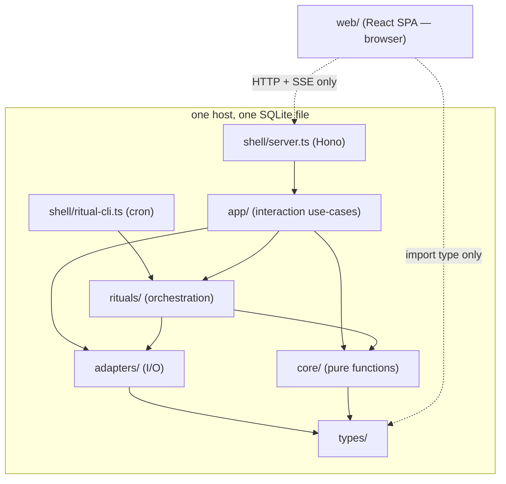
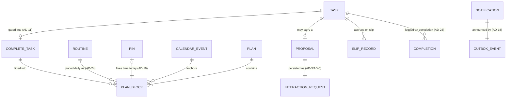
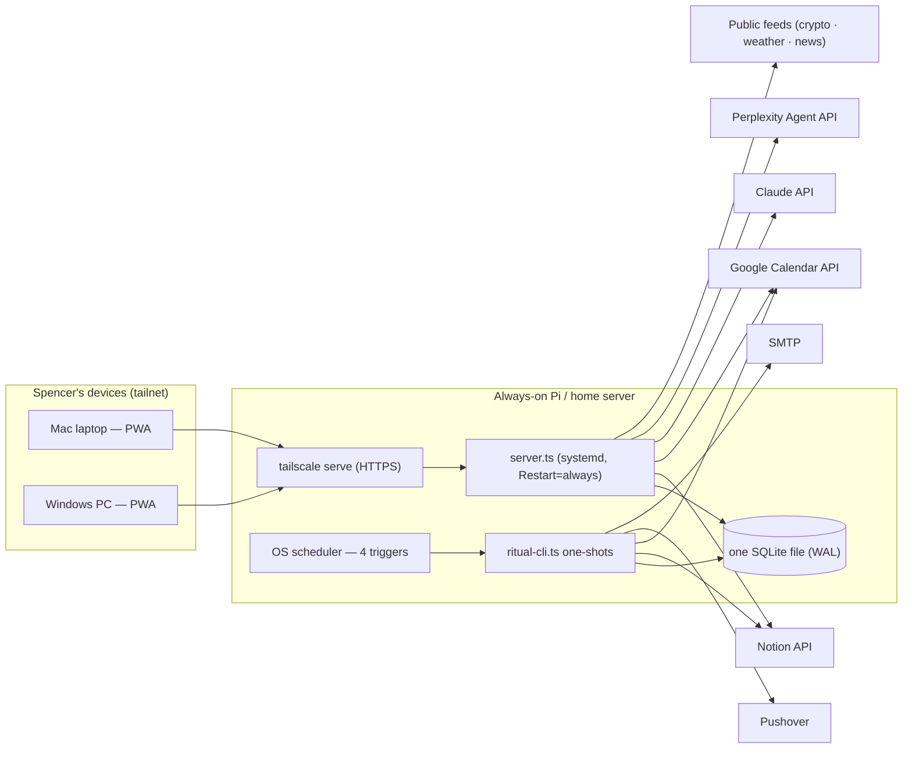

# Architecture Spine — Yoh

## Design Paradigm

**Functional Core / Imperative Shell.** Planning and ritual logic is a set of pure, stateless functions with no I/O and no shared state (`core/`); everything that touches the outside world — Notion, Google Calendar, Pushover, email, Claude, SQLite — lives in thin adapters (`adapters/`); orchestration (`rituals/`) wires core + adapters together per ritual; two CLI entry points (`shell/`) are the only way in. A function's typed signature is its contract — no ports/DI abstraction layer, since adapters here are swapped by phase (CLI now, web later), never at runtime.

This directly satisfies the PRD addendum's own architecture guidance ("keep planning/ritual logic decoupled from the CLI presentation layer, so Phase 2+ surfaces can call the same core logic instead of forking it") and the build-time constraint this spine was commissioned under: implementation tasks must be independent, file-owned, and expressed as explicit Consumes/Produces signatures rather than shared mutable state.

**Ritual output is never a blocking question.** Every ritual runs unattended and to completion, then exits. If it needs an answer from Spencer (a missing Task field, a close-out confirmation, a Self-Check score), it persists that need as an **open interaction request** and exits — it never holds the process open waiting. An interactive surface is the only place an open interaction request gets resolved, whenever Spencer next opens one: `chat-cli.ts` through Phase 1.5, and the Web App through `app/` from Phase 2 (AD-16). This is the one addition the review pass forced into this section, because it changes what "ritual" means architecturally: a ritual is a state transition plus, optionally, a durable question — never a wait.

**Phase 2: one core, many surfaces, one interaction layer.** The Web App is a new shell, not a new system. Every interactive capability (confirming a `Proposal`, checking off a Task, a /sandbox card, a drag-reshuffle, a chat turn) is a function in a surface-agnostic `app/` layer. Shells only translate transport (HTTP, or terminal text until the CLI retires) into `app/` calls. The browser client (`web/`) is a pure view over the server API: it renders what the server computed and never plans anything itself. Two processes share one SQLite file on one always-on host. The OS-scheduled ritual one-shots stay exactly as they were, and a new supervised server process handles everything interactive.

## Invariants & Rules



### AD-1 — Functional Core / Imperative Shell layering

- **Binds:** all
- **Prevents:** planning/ritual business logic entangling with I/O, or getting reimplemented per surface (CLI now, web/hardware/iOS later)
- **Rule:** dependency direction is strictly `shell → rituals → {core, adapters}`; `adapters → types` only. Files under `core/` may import only from `types/` and other `core/` files — never from `adapters/`, `rituals/`, or `shell/`. `[ADOPTED]`
  - **Phase 2:** an `app/` layer sits between the interactive shells and everything below: `shell/{server,chat-cli}.ts → app → {rituals, core, adapters}`. `shell/ritual-cli.ts` keeps calling `rituals/` directly and **never imports `app/`**. `rituals/` never imports `app/` either. `web/` is outside this graph: it reaches the system only over HTTP/SSE (AD-17) and imports only types (`import type` from `types/`). `[ADOPTED, revised for Phase 2]`

### AD-2 — No shared mutable state across core functions

- **Binds:** `core/*`
- **Prevents:** two independently-built core functions each passing their own tests yet corrupting shared state when composed
- **Rule:** every `core/*.ts` file exports pure functions only — same inputs produce the same outputs, no reads/writes to module-level variables, no mutation of arguments. Prior state a function needs (yesterday's slip count, the last Self-Check score) is passed in as an explicit parameter, never fetched internally. `[ADOPTED]`

### AD-3 — Propose-Don't-Impose modeled as durable, versioned data

- **Binds:** FR-16 (learned pattern), FR-5 (Time Budget change suggestion), FR-25 (Data-Completeness Gate inferred field-value suggestion), FR-26 (Notion page/DB draft), FR-27 (Calendar time-block edit proposal — see AD-13 for the calendar-specific mechanics layered on top of this), FR-32 (Reshuffle Preview, AD-19), FR-48 (surface-agnostic confirmation)
- **Does not bind:** FR-10. Rescheduling around a reported Blocker is unconditional and automatic — FR-10's own consequence text is explicit that Yoh "does not generate suggestions for resolving the underlying obstacle." The Glossary's Propose-Don't-Impose entry names "a Blocker resolution" as a confirmation-gated case, but Phase 1 has no code path that ever produces a Blocker-resolution suggestion to confirm — that clause describes a boundary that stays permanently unreached in this scope, not a gate FR-10's mechanical reschedule must pass through. **Also does not bind:** FR-29 (file search result to Research Vault) — see AD-12; FR-29 is modeled as direct-write, the same shape as FR-24, not a Proposal. **Amended 2026-09-27 (Spencer):** a Task Spencer types himself on the Tasks page (`app/create-task.ts`, Story 11.1/Task 6B) is also direct-write, not a Proposal — see AD-12's matching amendment. Only a Task Yoh drafts from Chat (FR-26) still routes through this AD.
- **Prevents:** a learned pattern, suggested Time Budget change, or Phase 1.5 draft/proposal silently taking effect because "propose" and "apply" share one code path; a stale proposal being applied against state that has since moved on; a proposal generated during an unattended ritual run having no path back to Spencer.
- **Rule:** any function that would suggest a behavior or budget change, or draft a Notion item, calendar edit, or field value for Spencer's review, returns a `Proposal<T>` value (the suggested change, its reason, and a snapshot/version of the entity it would change) instead of performing it. `memory-store.ts` persists every open `Proposal` as an open interaction request. Only an `app/*` function, called from an interactive shell after an explicit yes/no from Spencer, may act on it. Through Phase 1.5 `chat-cli.ts` was the only such shell. **Phase 2 (FR-48):** Web App controls (the Reshuffle Preview's Approve, a Chat confirm button, a Structured Question option) and a typed "yes" are equally valid confirmations, because each surface calls the same `app/` confirm function with the same staleness check. No surface has its own apply path. Where the sub-bullets below say "`chat-cli.ts` calls/extracts", read it as "the `app/` function calls/extracts" once the logic has migrated (AD-16).
  - **Phase 2 instantiation:** Drag-to-Reshuffle produces a `Proposal<ReshufflePreview>` (FR-32, AD-19). Its snapshot is a version of today's calendar, and a stale Approve recomputes and returns a fresh preview instead of just rejecting.
  - **`apply(proposal)` is a pattern name, not one literal shared signature.** Each concrete write function has its own calling convention, and `chat-cli.ts` calls each one directly — there is no single generic `apply(proposal: Proposal<unknown>)` dispatcher every write function conforms to. For FR-16/FR-5 (learned pattern, Time Budget) and FR-27 (`applyCalendarEdit`, AD-13), the function takes the `Proposal` itself, re-reads the live entity, and rejects with `YohError.kind: 'stale-proposal'` if its version no longer matches the snapshot. For FR-25/FR-26, `chat-cli.ts` extracts the confirmed `Proposal`'s payload (the suggested field value; the `NotionPageDraft`'s `database`/`properties`) and calls the adapter's plain write function directly (`updateTaskField`, `createPage`) — these functions take unwrapped arguments, are not named `apply*`, and pre-date this AD.
  - **The stale-proposal re-read does not apply to a `Proposal<T>` that creates a new entity rather than modifying an existing one** — currently, `Proposal<NotionPageDraft>` (FR-26) and `Proposal<CalendarEditChange>`'s `create` variant (FR-27, AD-13). There is no live entity to re-read before something exists. AD-12's draft-time/write-time schema re-resolution is the substitute integrity guarantee for `NotionPageDraft`; AD-13's `applyCalendarEdit` simply skips the re-read for its `create` variant.
  - **FR-29 is a direct write, never routed through this Proposal/confirm machinery** — it calls `createPage` the same way FR-24 calls `updateTaskField`, on Spencer's explicit "save that" request, with no draft-then-confirm step. A shared confirm-gating helper must not swallow FR-29's `createPage` call the way it would FR-26's — the two are distinguished by which caller invokes `createPage`, not by anything in `createPage`'s own signature, so `chat-cli.ts`'s FR-26 handling and its FR-29 handling stay two separate call sites, never a shared "confirm then createPage" helper both funnel through.
  Phase 1.5 introduces no new generic mechanism here — FR-25/FR-26/FR-27 each instantiate `Proposal<T>` with their own `T` (a field-value suggestion, a Notion page/DB draft, a calendar-edit description), and the calling convention above is what actually reaches each one's write function. `[ADOPTED, revised for Phase 1.5]`

### AD-4 — Calendar ownership by construction

- **Binds:** FR-21, FR-22
- **Prevents:** an update or delete ever reaching a Calendar event Yoh didn't create
- **Rule:** on this AD's automatic path, `calendar-adapter.ts` writes, updates, and deletes only within a dedicated "Yoh Plan" secondary calendar; against the primary calendar the automatic path may only read, never call insert/update/delete — AD-13 defines the sole confirm-gated exception, via a separately-scoped client this AD's automatic path never touches. On first run, `calendar-adapter.ts` creates the "Yoh Plan" calendar itself via the Calendars.insert API if it doesn't already exist, and `token-store.ts` persists the returned calendar ID — so the app-created precondition the narrower write scope depends on is actually true, not just assumed. Read access to the primary and write access to "Yoh Plan" use separate OAuth scopes (`calendar.events.readonly` and `calendar.app.created` respectively — confirmed against the already-built `token-store.ts`), so a coding mistake in the automatic path that tried to write the primary fails at the API layer, not just at review.
- **Honesty note:** the technical research verified primary-calendar-plus-tagging as the documented pattern; it found no practitioner consensus for or against a dedicated secondary calendar. This spine chooses the secondary-calendar approach anyway — construction-guaranteed ownership plus a narrower write scope is a strictly harder guarantee than a runtime tag-check, matching the PRD's above-usual data-integrity bar — but that choice is this run's judgment call, not something the research itself settled. `[ADOPTED]`
- **Phase 1.5 note:** this AD's guarantee (primary calendar is read-only at the OAuth-scope level, for this path) is genuinely unchanged for the automatic path it governs — not merely asserted. FR-27 introduces a confirm-gated exception (AD-13) that needs a broader grant, but AD-13 gets that grant through a **second, separately-scoped `OAuth2Client`** (AD-10) rather than widening the client this AD's automatic path uses. The automatic path's credential still cannot write the primary calendar; only AD-13's own, differently-scoped client can, and only from AD-13's own confirm-gated function.

### AD-5 — Ritual triggers are independent one-shot subcommands; interaction requests are durable

- **Binds:** FR-1, FR-4, FR-9, FR-10, FR-12, FR-13, FR-14, NFR-Reliability *(FR-17 retired 2026-09-29: the Rating is in-app only, AD-31)*
- **Prevents:** an unattended cron process being asked to block for a live answer (which it structurally cannot do); ritual subcommands inventing their own unshared assumptions about how or when they're triggered
- **Rule:**
  - `ritual-cli.ts` exposes three independently OS-scheduled one-shot subcommands, each cron/systemd-timer/launchd-triggered at its own time and none of them blocking for input: `morning` (FR-1–FR-4), `night-prompt` (FR-12, sends the first close-out prompt), and `night-escalate` (FR-13–FR-14, scheduled some hours after `night-prompt`; checks `memory-store.ts` for whether that night's close-out was already answered, and if not, sends the capped second attempt via email and marks the day unchecked). `self-check` (retired, AD-31).
  - Any of these that needs an answer — a missing Task field (FR-4), a close-out confirmation (FR-12) — persists it in `memory-store.ts` as an open interaction request, then exits. It does not wait.
  - *(Phase 1/1.5 wording; generalized to `app/` by the Phase 2 bullet below.)* `chat-cli.ts` is the single on-demand REPL entry point and the only place an open interaction request or open `Proposal` gets resolved. On start, and before accepting an unrelated command, it surfaces any open interaction requests — matching the UX requirement that an open confirmation blocks the chat flow rather than queuing silently alongside something else. `chat-cli.ts` also handles: on-demand Plan viewing, Mid-Day Re-Flow triggers (FR-9), Blocker reports (FR-10 — reschedules immediately, no confirmation per AD-3), Time Budget changes, and any other free-text input, routed and answered via `llm-adapter.ts`.
  - **Phase 1.5:** every successful write `chat-cli.ts` triggers or applies — a confirmed `Proposal` (AD-3: FR-25/26/27) or a direct write (AD-12: FR-24/29) — is echoed back to Spencer in that same chat session as a one-line receipt naming what changed, per NFR-DataIntegrity's chat-receipt requirement. This is a `chat-cli.ts` output responsibility, not new storage or a new adapter — the write functions themselves (`updateTaskField`, `createPage`, `applyCalendarEdit`) return enough detail in their success value for `chat-cli.ts` to compose the one-line receipt from, rather than needing to re-query.
  - Neither shell file contains ritual or core logic itself — both call into `rituals/*`. `[ADOPTED]`
  - **Phase 2 (FR-42, FR-48, FR-50):** `ritual-cli.ts` and its three cron subcommands are unchanged. Every `chat-cli.ts` responsibility above (surfacing open interaction requests first, resolving `Proposal`s, Plan viewing, Re-Flow, Blockers, Time Budget, free-text routing, receipts) moves into `app/` (AD-16), and both `shell/server.ts` and `chat-cli.ts` call it. On the Web App, open interaction requests and `Proposal`s render at the top of Chat. An open item blocks only writes that conflict with it (e.g. another answer to the same Task field, or a second reshuffle while one is open), never unrelated chat. `/morning` reads today's stored Plan and open items and never regenerates or re-pushes. `/night` records the close-out through the same `memory-store.ts` record `night-escalate` already checks. `night-prompt` gains the same check and is a no-op if tonight's close-out is already recorded, so an early `/night` cancels both the prompt and the escalation and the day is never marked unchecked. `chat-cli.ts` is deleted once FR-42's parity list passes against the Web App. Deleting it removes no logic, because the logic already lives in `app/`. A ritual's open close-out surfaces as an open item in Chat, plus its existing Pushover/email channel. It raises **no** in-app notification, which keeps FR-49's no-proactive-nudge rule. The only ritual-raised in-app notifications are `needs-data` (FR-34, the result of a planning run) and `operational` (AD-7).

### AD-6 — Escalate-Under-Strain: one shared curve, three consumers, one pinned signature

- **Binds:** FR-11 (Slip-Bump), FR-19 (Tone) *(the FR-17 Self-Check consumer retired 2026-09-29; the Rating's shortened interval lives in `core/rating-schedule.ts`, AD-31)*
- **Prevents:** the three escalation mechanics drifting into inconsistent shapes, or each consumer inventing its own metric/level types such that "same strain → same escalation" (FR-19's testable consequence) can't actually be checked
- **Rule:** `core/escalate-under-strain.ts` exports exactly `computeEscalation(strainCount: number, curve: EscalationCurve): EscalationLevel`, both types defined once in `types/domain.ts`. `strainCount` is always a plain non-negative integer count of consecutive strain events (consecutive slipped days for Slip-Bump; the Task's current Slip-Bump level for Tone) — no consumer derives its own normalized score or its own level enum. `slip-bump.ts` and `tone.ts` each supply only their own `curve` (cap, step). `[ADOPTED]`

### AD-7 — Observability: ritual-failure and silent-absence alerting

- **Binds:** NFR-Observability, NFR-Reliability, FR-1, FR-12
- **Prevents:** a crashed cron job, an expired token, or an unreachable API going unnoticed because there is no one else to see it fail — and, separately, a ritual that never ran at all going unnoticed the same way
- **Rule:**
  - Every `ritual-cli.ts` subcommand wraps its entire invocation in one top-level handler; any thrown error or `Result` failure triggers a Pushover alert (via `notification-adapter.ts`) worded distinctly from a normal Plan/close-out notification, before the process exits non-zero.
  - Every `ritual-cli.ts` subcommand also checks, on start, that `memory-store.ts` recorded a successful run of its own previous scheduled occurrence; a missing prior run is itself treated as a failure and alerted. This is a self-referential dead-man's switch, not an external one — a total host or scheduler outage spanning every future invocation has no detection inside Yoh itself (see Deferred).
  - The Google OAuth "In production" consent-screen setting (Deferred, below) is a precondition of this AD holding at all for FR-20/FR-21/FR-23: a Testing-mode 7-day silent token expiry would produce exactly the unnoticed-failure mode this AD exists to prevent. `[ADOPTED]`
  - **Phase 2:** the server process (AD-15) is covered by the same dead-man's switch. It writes a heartbeat record on a fixed interval, and `ritual-cli.ts morning` checks it on start and sends a Pushover alert if it's stale. A dead server therefore surfaces by the next morning at the latest, even though nobody may open the browser. Every alert condition also appends an in-app notification (FR-49, AD-18) so it's visible if the Web App is open. Pushover remains the channel that doesn't depend on the server being up. `[ADOPTED, revised for Phase 2]`

### AD-8 — Result types across the core/adapter boundary

- **Binds:** `core/*`, `adapters/*`
- **Prevents:** an adapter's I/O exception surfacing as an unhandled throw inside a ritual's otherwise-pure orchestration, or a core function silently swallowing an invalid-input case
- **Rule:** every `core/*.ts` function returns `Result<T, YohError>` and never throws. `adapters/*.ts` functions may throw on I/O failure; `rituals/*.ts` is the only layer allowed to catch an adapter's throw and convert it into a `Result` failure or an AD-7 alert. `YohError.kind` includes at minimum: `missing-field`, `auth-expired`, `unreachable`, `rate-limited`, `validation`, `stale-proposal` (AD-3), `conflict` (AD-10). `[ADOPTED]`

### AD-9 — File-level task ownership, with shared types locked first

- **Binds:** all
- **Prevents:** two build tasks needing to co-edit the same file; a shared "utils" file becoming a bottleneck several tasks incrementally extend; two files independently declaring incompatible shapes for the same shared type; a `PlanBlock` addressed inconsistently by different callers
- **Rule:**
  - Every behavior in the Structural Seed's source tree has exactly one file as its home. A new capability that doesn't fit an existing file gets a new file — never an addition bolted onto a file owned by a different capability.
  - `types/domain.ts` is authored and reviewed as its own prerequisite task before any file that imports from it is dispatched. No file may locally redeclare, widen, or shadow a type `domain.ts` already exports.
  - `PlanBlock` carries a stable `id`. Every reference to a `PlanBlock` — lookup, update, reorder, in `slip-bump.ts`, `night-ritual.ts`, or `mid-day-reflow.ts` alike — addresses it by `id`, never by array position. `[ADOPTED]`
  - **Phase 2:** the browser-server contract is locked the same way. `types/api.ts` (request/response/event shapes, `ChatMessage` including the Structured Question variant, `NotificationKind`, `ReshufflePreview`'s wire shape) is authored and locked before any `app/`, `shell/server.ts`, or `web/` file that uses it. The drag UI addresses blocks and Tasks by `PlanBlock.id` / Notion Task id, never by screen position or list index. `[ADOPTED, revised for Phase 2]`

### AD-10 — Storage split by concern; single owner for the OAuth client; transactional writes

- **Binds:** `adapters/*`, FR-15, FR-20–FR-23
- **Prevents:** the refresh-token-persistence gotcha the technical research flagged (the OAuth client library refreshes a token in memory but doesn't persist it back) recurring because two files each keep their own copy; `storage-adapter.ts` becoming a single file two unrelated tasks (memory vs. auth) both need to edit (violates AD-9's own spirit); a `ritual-cli.ts` run and a concurrent `chat-cli.ts` session silently clobbering each other's writes to the same day's Plan
- **Rule:**
  - *(Epic 13, 2026-09-29: Memory Items, chat history, settings, and ratings each get their own owner — AD-25, AD-26, AD-29, AD-31. `memory-store.ts` keeps interaction requests and Proposals.)* Storage is two files, not one: `memory-store.ts` owns hot/cold memory (FR-15) and all open interaction requests / open `Proposal`s (AD-3, AD-5). `token-store.ts` owns the Google OAuth refresh token(s) and is the **sole constructor and holder** of the Calendar `OAuth2Client`(s) — `calendar-adapter.ts` receives an already-authenticated client as a parameter for whichever operation it's performing and never imports `google-auth-library` itself. `token-store.ts` rewrites each refresh token to disk immediately after every refresh.
  - **Phase 1.5 (AD-13):** `token-store.ts` constructs and holds **two separately-scoped Calendar clients**, not one — a narrow client (`calendar.events.readonly` on primary, write scope on "Yoh Plan" only) that AD-4's automatic path exclusively uses, and a second, broader client (`calendar.events` — read/write across accessible calendars) that only AD-13's `proposeCalendarEdit`/`applyCalendarEdit` pair uses. This is why AD-4's "fails at the API layer, not just at review" guarantee survives AD-13's arrival unweakened: the automatic path's credential still physically cannot write the primary calendar, because it was never handed the broader-scoped client. A single shared client with the union of both scopes was considered and rejected — it would make AD-4's API-layer defense literally false the moment AD-13's scope widening landed, silently downgrading it to a code-review-only guarantee, which is exactly what AD-4 states it doesn't want to rely on.
  - Static secrets (Notion token, Google OAuth client id/secret, Pushover key, SMTP credentials, Claude API key, Perplexity API key — AD-14) load once from environment variables at process start; only the Google refresh token(s) are persisted, mutable secrets, and each has exactly one owner (above, AD-13's second client included).
  - Every multi-step read-modify-write sequence in `memory-store.ts` runs inside a single SQLite transaction with optimistic concurrency (a version/`updated_at` column checked on write). `ritual-cli.ts` and `chat-cli.ts` are allowed to run concurrently; the storage layer, not its callers, is responsible for detecting a conflicting write and surfacing it as `YohError.kind: 'conflict'` rather than silently applying last-write-wins. `[ADOPTED]`
  - **Phase 2:** the long-running server (AD-15) and the cron one-shots share one SQLite file (WAL mode, already on). The concurrency rule above covers them unchanged. No process holds a read transaction open across an `await` or longer than one request or ritual step, so WAL checkpoints are never starved by the long-running server. If WAL growth is ever observed, `PRAGMA wal_checkpoint(TRUNCATE)` in the nightly backup job is the fallback. **One connection helper.** `adapters/sqlite.ts` is the only file that opens the SQLite file. It opens one connection per process with WAL, a `busy_timeout`, and `foreign_keys` on, and it exports `writeTx(fn)`, which runs `fn` inside `BEGIN IMMEDIATE`. Every store file, including `memory-store.ts` (refactored to take the shared handle, one story), receives that handle and does all multi-step writes through `writeTx`. No store opens its own connection. A change that spans owners (for example, job done + notification + outbox row, AD-18/AD-21) runs inside one `writeTx`, calling each owner's exported `…InTx(tx, …)` function, so atomicity doesn't require any owner to touch another's tables. New Phase 2 owners get **dedicated SQL tables** (ordered/indexed columns: the outbox `seq`, job status + `claimed_at`, completion dates) rather than `memory-store.ts`'s generic `(kind, id)` blob table, and each creates its own tables idempotently on startup. New durable data gets new owner files, each owning its own record kinds in that file: `completion-log.ts` (Task completions + activity days, FR-47), `routine-store.ts` (FR-35), `plan-state-store.ts` (today's Pins, pending check-offs, the open reshuffle proposal pointer, and the server heartbeat), `notification-store.ts` (in-app notifications, read state, and the event outbox, AD-18), and `job-store.ts` (/research jobs, AD-21). **Each record kind has exactly one owning file. No file reads or writes another file's kinds directly; it calls that file's exports.** `memory-store.ts` keeps its existing kinds and takes on none of these. `[ADOPTED, revised for Phase 2]`

### AD-11 — Data-Completeness Gate enforced at the type level

- **Binds:** FR-4 (two-tier as of Phase 2), FR-25 (inferred-value proposal, layered on the same gate), FR-34, FR-36, Non-Goal §8 ("will not silently default or drop Tasks with missing required fields")
- **Prevents:** a future Plan-assembly code path bypassing the gate and including a Task with a missing field, defaulted or not
- **Rule:** `data-completeness-gate.ts` is the only function that produces a `CompleteTask` value from a raw `Task`. Every function downstream of the gate — `derived-priority.ts`, `work-break-fit.ts`, `plan-reasoning.ts` — accepts `CompleteTask`, never `Task`, in its signature. A Task with a missing required field cannot type-check its way into Plan assembly; it can only ever produce an open interaction request (AD-5) asking for the missing field.
  - **FR-25 suggestion generation is lazy, at `chat-cli.ts` display time — never eager, at ritual time.** `data-completeness-gate.ts` is `core/*` (AD-1: imports only from `types/`, never `adapters/`) and so cannot call `llm-adapter.ts` itself; the gate only ever produces the plain `{kind: 'missing-field', taskId, field}` placeholder request, persisted as-is by `memory-store.ts`. `rituals/morning-ritual.ts` does not call `llm-adapter.ts` either — "chat context" (FR-25's own trigger condition) is typically sparse or nonexistent at an unattended 6am ritual run, before Spencer has said anything that day. Instead, `chat-cli.ts`, at the moment it's about to surface that stored placeholder to Spencer (AD-5's "surfaces any open interaction requests" step), calls `llm-adapter.ts` on demand to attempt an inference from recent chat context, and only then constructs the `Proposal<FieldValueSuggestion>` (AD-3) to show instead of a blind ask. `memory-store.ts` never stores a pre-built `Proposal` for this case — the stored record is always the bare placeholder; enrichment happens at display time, every time, not once at write time. `[ASSUMPTION: lazy/display-time generation, not eager/ritual-time]`
  - Either way, the gate itself is unchanged: only a confirmed answer (typed directly, or a confirmed `Proposal`) ever produces a `CompleteTask`, and the confirmed value flows through the existing `updateTaskField` write path (AD-12) FR-24 already established — FR-25 changes how the value is arrived at, never the write mechanism. `[ADOPTED, revised for FR-25]`
  - **Phase 2 — two tiers (FR-4 amended).** `CompleteTask` now requires only the **Required Fields** (Due Date, Estimated Duration) to be present. The **Refining Fields** (Area, Energy) are typed as an explicit `Refining<T> = {kind: 'set', value: T} | {kind: 'missing'}` union, never `T | undefined` and never a defaulted `T`. `derived-priority.ts` maps `'missing'` to its neutral score internally, and that neutral value exists only inside the scoring computation. It is never stored, sent to the client as a real value, or written to Notion. The Plan and `ReshufflePreview` carry each placed Task's missing-Refining list so the UI can mark it (FR-4). A Task missing a Required Field still cannot become a `CompleteTask`, so it cannot be placed. It produces the existing `missing-field` placeholder request plus a needs-data in-app notification (FR-34, AD-18).
  - **The /sandbox queue (FR-36) is computed, not stored.** One function, `app/sandbox-queue.ts`, derives the queue from the live Notion Tasks by running the gate: Tasks missing a Required Field, ordered soonest-due first `[ASSUMPTION: FR-36 ordering]`. The live counter (FR-37), the needs-data indicator, and the needs-data notification's count all read this one function. None of them keeps its own count. `[ADOPTED, revised for Phase 2]`

### AD-12 — Notion write surface is enumerated, schema-checked, and interactive-only

- **Binds:** FR-23, FR-24, FR-26, FR-29, FR-38, FR-41, FR-51, NFR-DataIntegrity
- **Prevents:** a Night Ritual close-out write touching any Task field other than Status; an attempt to write a rollup or formula property, which Notion documents as not updatable; a `select`-backed property being written a value that doesn't already exist as a real option (Notion silently creates a new option for an unrecognized `select` write, corrupting Spencer's taxonomy); a created page landing outside the three Notion databases Yoh is allowed to touch; or any of this being reachable from a cron-triggered `ritual-cli.ts` subcommand
- **Rule:** `notion-adapter.ts`'s write surface stays a closed, enumerated set — `setTaskStatus` (Status only, on Night Ritual close-out or a Data-Completeness Status answer), `updateTaskField` (FR-24, writes only the fields named in `types/domain.ts`'s `PlanningFieldNames` — Estimated Duration, Area, Due Date, Energy, Status — and nothing else), and `createPage(database, properties)` (FR-26/FR-29) — there is still no generic "update or create any Notion property/page" function. `createPage`'s `database` parameter is a closed enum — `Tasks | Projects | ResearchVault` — matching FR-26's own PRD-stated restriction; no other Notion database is ever a valid target, regardless of what the integration token can technically reach. FR-29 (file a search result to the Research Vault) reuses `createPage` with `database: 'ResearchVault'` — no separate function.
  Before `updateTaskField` or `createPage` writes a `select`-backed property (Area when modeled as a `select` rather than `rich_text`; Energy), it retrieves that property's live option list (`dataSources.retrieve`) and resolves the value to one of those real, existing options — exact match, then normalized match, then closest-match by edit distance within a bounded threshold — never writing raw or invented text into a `select` property; a value that can't be confidently resolved fails the write rather than guessing or creating a new option. A `rich_text`-backed Area, Due Date (`date`), and Estimated Duration (`number`) are written directly — no live-option check applies to a property type Notion can't silently corrupt this way. For `createPage`, this same schema resolution runs twice: once at draft-construction time (so the `Proposal<T>` shown to Spencer per AD-3 is actually accurate) and again, authoritatively, at write time — the draft-time check is a UX quality measure, the write-time check is the binding guarantee.
  **`setTaskStatus` history.** *2026-09-22:* `setTaskStatus` became schema-checked through the same live-option `closestOption` resolution Area and Energy use, after Spencer renamed his Status options. That still holds. The same revision also moved completed Tasks to Notion Trash (`in_trash: true`). **Reverted 2026-09-25 (Spencer):** `setTaskStatus` writes the Status property only and never trashes, from any trigger (Night close-out or FR-41 check-off). This satisfies FR-41 and §9.4 (check-off never deletes) and FR-43 (Tasks shows completed Tasks). Completion history is Yoh's own Completion Log (FR-47, AD-10), not Notion's. No Phase 2 capability deletes anything from Notion.
  **Interactive-only (revised for Phase 2).** All three write functions are called only from `app/*` (AD-16), which only interactive shells reach. They are never called from `rituals/*` or `shell/ritual-cli.ts`, which can't reach `app/` (AD-1). This rule replaces the old "only from `shell/chat-cli.ts`" rule and keeps the property it protected: a cron-triggered run never writes to Notion. Phase 2 callers: FR-41 check-off → `setTaskStatus` (direct-write, committed by AD-20); FR-38 /sandbox cards → `updateTaskField` (direct-write, **synchronous per card**, same guard and re-prompt-on-unresolvable as FR-24; when the session ends, `app/sandbox-submit.ts` raises `sandbox-complete` or `sandbox-failed` only after every card write has settled); FR-51 /research filing → `createPage('ResearchVault', …)` (direct-write, same as FR-29, run by AD-21's job runner inside the server process on Spencer's explicit command). **Tasks-page direct write (amended 2026-09-27, Spencer):** a Task Spencer types himself in the Tasks page's quick-add row calls `createPage('Tasks', …)` directly (Story 11.1/Task 6B) — same draft-time + write-time schema resolution as above, no confirm step, because Spencer's own typed instruction is the confirmation (the same reasoning FR-24 already established). This amends AD-3: only a Task **Yoh** drafts from Chat (FR-26) still goes through Proposal/confirm. `[ADOPTED, revised for FR-26/FR-29, revised 2026-09-22 for setTaskStatus schema-checking, revised 2026-09-25 for Phase 2 + trash-on-completion reverted, revised 2026-09-27 for Tasks-page direct write]`
  **2026-09-27 (Spencer):** the closed write surface gains updateTaskTitle — the title of an existing Task, from Spencer's own edit on the Tasks page only.
  **2026-10-04 (Spencer):** the closed write surface gains `archiveTask` — the one move-to-Trash (`in_trash: true`), called only by `app/update-task.ts`'s `deleteTask` when Spencer approves a chat change set that contains a `delete-task` item (AD-32). The write surface is now five functions: `setTaskStatus`, `updateTaskField`, `createPage`, `updateTaskTitle`, `archiveTask`. `setTaskStatus` still never trashes; check-off still never deletes. This replaces "No Phase 2 capability deletes anything from Notion" above. `updateTaskTitle` is also reached from an approved change set (`rename-task`). Pinned by the AD-12 test in `tests/notion-adapter.test.ts`.

### AD-13 — Confirm-gated exception to Calendar ownership (FR-27)

- **Binds:** FR-27
- **Prevents:** FR-27's confirm-gated Calendar edits being implemented as a second, parallel ownership model instead of a narrow exception layered on AD-4/AD-3; a future caller constructing a delete against a non-Yoh event, even by accident
- **Rule:** the ownership-routing decision is a single named, exported function — `resolveCalendarEditRoute(eventId): {kind: 'owned'} | {kind: 'external'}` in `calendar-adapter.ts` — checking the `PLAN_BLOCK_ID_EXTENDED_PROPERTY` tag AD-4 already uses to recognize a Yoh-created event. Every caller, including AD-4's own automatic update/delete functions, goes through it rather than re-deriving tag status inline; `chat-cli.ts` calls it first for any FR-27 request. `'owned'` stays on AD-4's existing automatic path, unchanged. `'external'` routes to two entry points, split by whether the target event already exists:
  - `proposeCalendarEdit(eventId, change: MoveOrResize)` — for `move`/`resize` only, where `eventId` names a real, existing event. Reads the live event and returns a `Proposal<CalendarEditChange>` (AD-3) describing exactly what would change.
  - `proposeNewCalendarEvent(change: CreateBlock)` — for `create`, which by definition has no `eventId` yet; takes no id parameter at all, so there is no live event for it to misread as existing.

  Both return a `Proposal<CalendarEditChange>`; only `chat-cli.ts`, after Spencer's explicit confirmation naming the specific event (or the specific new block, for `create`), calls the matching `applyCalendarEdit(proposal)`. `CalendarEditChange` is a union type with `move`, `resize`, and `create` variants only — there is no `delete` variant on this path, so a non-Yoh event cannot be deleted even by a future coding mistake; it isn't a value the type system can construct here, not merely a rule someone has to remember. `applyCalendarEdit` takes the `Proposal` itself (unlike `createPage`/`updateTaskField` — see AD-3's clarified calling convention) because it needs the snapshot for AD-3's staleness re-check on `move`/`resize`; for `create`, there is no live entity to re-check, so `applyCalendarEdit` skips that step for the `create` variant specifically, the same exemption AD-3 grants `NotionPageDraft`.
- **Dependency:** `proposeCalendarEdit`/`proposeNewCalendarEvent`/`applyCalendarEdit` use the second, broader Calendar `OAuth2Client` AD-10 constructs for exactly this purpose (`calendar.events` scope — read/write across **all** calendars Spencer's account can access, not primary-only — Google's scope catalog has no narrower "primary only" grant, confirmed 2026-09-18) — never the narrow client AD-4's automatic path uses. "Primary only" is enforced entirely by `calendar-adapter.ts` checking `calendarId === 'primary'` before any AD-13 write, not by the OAuth grant itself. Spencer explicitly confirmed accepting this broader grant (the real, only available option) over narrowing FR-27's scope to avoid it. `[ADOPTED, confirmed by Spencer 2026-09-18]`

### AD-14 — Web search adapter (FR-28), read-only, routed through existing chat intent routing

- **Binds:** FR-28, FR-29 (search leg only — the write leg is AD-12)
- **Prevents:** search becoming a second, uncoordinated intent-classification system alongside `llm-adapter.ts`'s existing one; a search call firing on an ordinary chat message and silently costing money; a search result being mistaken for a Notion/Calendar write
- **Rule:** a new `adapters/search-adapter.ts` exports exactly `search(query: string): Promise<Result<SearchAnswer, YohError>>`, where `SearchAnswer = { answer: string, citations: string[] }` is added to `types/domain.ts`'s locked inventory (AD-9) — pinned once, the same way AD-6 pins `computeEscalation`'s signature, so `llm-adapter.ts` (the caller) and `search-adapter.ts` (the implementer) can't independently diverge on the result shape. It never calls into `notion-adapter.ts` or `calendar-adapter.ts` itself and holds no write capability of any kind — FR-28's "writes nothing as a side effect" requirement is structural (the file has no import path to a write function), not just documented behavior. A legitimate zero-result answer is a successful `Result` with an empty `citations` array, never a `YohError`.
  Trigger classification (an explicit ask, or an unambiguous factual question, versus an ordinary planning/status message that must never fire a paid call) is not new infrastructure — it is one more variant of `llm-adapter.ts`'s `ChatIntent` discriminated union (AD-5, `types/domain.ts`), alongside `mid-day-reflow`, `blocker`, `open-prompt-answer`, and `general-question`: `{ kind: 'search-trigger', query: string }`. `chat-cli.ts` dispatches on `ChatIntent.kind`; a `'search-trigger'` result calls `search-adapter.ts`'s `search()`, nothing else does.
  `search-adapter.ts` calls Perplexity's **Agent API** (`/v1/responses`) directly via Node's built-in `fetch` — no SDK dependency, the same minimal-dependency style already used for Pushover — targeting this endpoint from the start rather than the Sonar `/v1/chat/completions` endpoint it replaces, which is deprecated 2026-09-27 (nine days after this AD was written; a build against Sonar chat completions would be dead on arrival). Citation extraction reads the `search_results` item inside the response's `output[]` array and maps it into `SearchAnswer.citations` — the Agent API does not carry a top-level `citations` field the way Sonar chat completions did, so `search-adapter.ts`'s response-parsing must not assume Sonar's shape.
- **Legitimate no-results is not a `YohError`.** A provider response with zero usable results is a successful `Result` carrying an empty/no-answer payload for `chat-cli.ts` to relay honestly — it is not thrown or wrapped in `YohError`. `YohError.kind: 'unreachable'` / `'rate-limited'` (AD-8) cover the real-failure case (the provider couldn't be reached, or refused the call); `search-adapter.ts` must not conflate "found nothing" with "failed," since FR-28 requires both to be surfaced honestly but they are not the same event.
- **Honesty note — this Non-Goal's only backstop is classification, not structure.** Unlike AD-13's type-level delete prevention, nothing here structurally prevents a search firing on a misclassified ordinary message — the safeguard is `llm-adapter.ts`'s intent-routing correctness alone. The one mechanism that would act as a hard backstop, a daily call cap, is Deferred (below), not `[ADOPTED]`, and even once built is a warn-Spencer measure, not a blocking one. Named plainly as a residual risk, the same way AD-7 names its own total-outage detection gap, rather than left implicit. `[ADOPTED, corrected 2026-09-18 for Sonar-to-Agent-API deprecation]`
- **Amended 2026-10-04 (as built, Epic 14 and commit `2e7f544`):** the `ChatIntent` union and the LLM classifiers (`classifyCapture`, `classifyChatIntent`) no longer exist, and `shell/chat-cli.ts` is deleted (FR-50). A search now starts in one of three ways, all in `app/`: (1) the deterministic pre-check `core/search-intent.ts`'s `parseSearchIntent` (an explicit "search: …" / "look up …" or a current-information cue), checked before any model call; (2) the `web_search` read tool inside the chat tool loop (AD-32), which the model may call; (3) the `/research` job runner (AD-21). `search-adapter.ts`'s contract above is unchanged. The honesty note still holds in a new form: route 2's only backstop is the model's choice of tool; the system prompt (`core/tone.ts`, built from `webSearchAvailable`) tells the model whether web search is configured.

### AD-15 — Process model and hosting: one always-on host, two process kinds, tailnet-only

- **Binds:** FR-39, FR-45, FR-50, FR-51, NFR-Reliability, NFR-CaptureSpeed, §7 Privacy/Cost
- **Prevents:** ritual reliability becoming coupled to web-server uptime; the Web App being unreachable from class or from the Windows PC; a login step creeping into the three-action capture flow; Yoh's API being exposed to the public internet
- **Rule:**
  - Everything runs on Spencer's always-on Pi/home server. The cron rituals stay OS-scheduled one-shots (AD-5, unchanged) and are **not** moved into the server. The server (`shell/server.ts`) is a separate, long-running, systemd-supervised process (`Restart=always`). It serves the built `web/` bundle, the JSON API, and SSE, and it runs AD-20's commit sweep and AD-21's job runner. It schedules no ritual.
  - The server listens on loopback only. It's reached exclusively through `tailscale serve`, which provides HTTPS with a MagicDNS certificate on the tailnet. It's never exposed via Funnel, port-forwarding, or a public domain. **Tailnet membership is the authentication**, so there is no login screen, session cookie, or password (FR-39). Only Spencer's own devices (Mac laptop, Windows PC) join the tailnet.
  - The one-click icon (FR-39) is the Web App installed as a PWA from the tailnet HTTPS origin. The PWA shell opens straight to Home or the launch splash (FR-45). `[ADOPTED: Spencer confirmed the always-on host 2026-09-25; Tailscale + PWA are ASSUMPTIONS to verify on the real school network and Windows browser, see Deferred]`

### AD-16 — Surface-agnostic interaction layer (`app/`)

- **Binds:** FR-42, FR-48, FR-50, and every interactive write (FR-24–FR-29, FR-32, FR-38, FR-41, FR-51)
- **Prevents:** the Web App re-implementing `chat-cli.ts`'s confirm/apply/parse logic so two surfaces drift; a Web control and a typed "yes" confirming under different rules; CLI retirement deleting logic the Web App still needs
- **Rule:**
  - `app/` holds one file per interaction use-case (e.g. `confirm-proposal.ts`, `check-off.ts`, `sandbox-queue.ts`, `sandbox-submit.ts`, `request-reshuffle.ts`, `approve-reshuffle.ts`, `chat-turn.ts`, `morning-view.ts`, `night-close-out.ts`, `queue-research.ts`). Each exports functions shaped `(deps, input) → Promise<Result<Output, YohError>>` with `input`/`Output` from `types/api.ts` or `types/domain.ts`.
  - Shells contain transport only: parse the HTTP request or terminal line, call one `app/` function, and render its `Result`. A shell file never calls an adapter's write function, never constructs or applies a `Proposal`, and never branches on business rules.
  - **`app/` functions are one-shot per turn and never block for input.** `chat-cli.ts`'s multi-question handlers that loop on `io.readLine()` (the data-completeness, night close-out, Self-Check, and Proposal-answer flows) are **restructured, not moved verbatim**. The interaction request persists which question is pending, each turn answers one question through `app/`, and the next question comes back in the response. The terminal and the Web App drive the same resumable flow. Their tests move and adapt with them.
  - `chat-cli.ts`'s existing logic is **moved** into `app/`, never copied. During the transition `chat-cli.ts` shrinks to transport over the same `app/` functions the server calls. Free-text parsing that is terminal-specific (e.g. `parseFieldAnswer`) moves too, because the Web chat accepts the same typed commands.
  - `app/` is the only layer that may call AD-12's Notion writes, AD-13's `applyCalendarEdit`, or AD-19's reshuffle apply. `[ADOPTED]`

### AD-17 — Browser client is a view over the server API

- **Binds:** FR-39–FR-46, NFR-Latency (interactive), NFR-Accessibility
- **Prevents:** planning logic forked into the browser and drifting from `core/`; a browser holding a Notion, Google, Anthropic, Perplexity, or feed credential; client and server disagreeing on a wire shape
- **Rule:**
  - `web/` is a Vite + React single-page app, built to static files and served by `shell/server.ts`. It talks to the system only through the server's HTTP API and SSE (AD-18). Calls go through the typed Hono RPC client generated from the server's route types, so request and response shapes are compiler-checked end to end.
  - `web/` may `import type` from `types/` and nothing else from `src/`. It never imports `core/`, `rituals/`, `app/`, or `adapters/`. **Every Plan, priority, reshuffle, gate result, and Desk metric is computed server-side**, and the client renders it. Client-side state is a cache of server state, refreshed after each mutation and on each SSE hint (AD-18).
  - Optimistic UI is visual only. The check-off fade, drag ghost, and thinking state start immediately to meet NFR-Latency and FR-46's motion rule. The authoritative result always comes from the server, and a failure is rendered as a failure (§6 Data integrity, Phase 2 writes).
  - **Ephemeral view state is client-only** and deliberately not server state: unsent chat text, scroll position, current page, an in-progress drag. The Screensaver is an overlay, not a navigation, so dismissing it restores all of this untouched (FR-45).
  - No secret, API key, or OAuth token is ever sent to the browser. The Content-Security-Policy is `default-src 'self'` (covering scripts, fonts, and `connect-src`), so the page can't call third parties or load a third-party script or font (AD-22, §7). `[ADOPTED]`

### AD-18 — Live delivery: SQLite outbox → server → one SSE stream

- **Binds:** FR-32 (apply result), FR-34, FR-38, FR-42 (streaming), FR-49, FR-51, NFR-Observability
- **Prevents:** a cron-ritual process (which can't talk to a browser) producing an event the open Web App never learns about; notifications lost when no tab is open; two notification mechanisms (one per producer) with different read-state rules
- **Rule:**
  - An in-app notification is a durable record owned by `notification-store.ts`: `{id, kind: NotificationKind, title, body, deepLink, createdAt, readAt?}`. `NotificationKind` is a closed union in `types/api.ts` covering FR-49's consumers: `research-ready`, `research-failed`, `sandbox-complete`, `sandbox-failed`, `needs-data`, `reshuffle-apply-failed`, `operational`. Any process (server or cron ritual) creates one through `notification-store.ts` only.
  - Every user-visible change, including a new notification, appends one row to an **outbox** in the same transaction: `{seq (monotonic), topic, entityId}`. The server tails the outbox `[ASSUMPTION: ~2s poll]` and pushes `{seq, topic, entityId}` hints over one SSE stream per open client (`GET /api/events`). SSE carries hints, never data. On a hint, the client re-fetches through the API. On reconnect it sends `Last-Event-ID` and the server replays from that `seq`.
  - The event stream sends an SSE comment keep-alive on every outbox poll tick, so `tailscale serve` or any intermediary never sees an idle connection. Chat responses stream on their own SSE response to the chat-turn request (FR-42 streaming, thinking/status text), separate from the event stream.
  - FR-49's "never a proactive check-in" is enforced by the closed `NotificationKind` union. A progress or check-in notification is not a constructible value. `[ADOPTED]`

### AD-19 — Drag-to-Reshuffle is a server-computed `Proposal` applied on the narrow Calendar client

- **Binds:** FR-9 (drag trigger), FR-30–FR-33, FR-31 (Pin), FR-2 (Pin never touches priority), NFR-Latency (≤ ~2 s preview)
- **Prevents:** a preview computed by different rules than the Morning Plan; a stale preview applied over a changed calendar; a Pin leaking into priority, Slip-Bump, or learning; a reshuffle touching a non-Yoh event; two open previews racing each other
- **Rule:**
  - A drag sends `{kind: 'move-block', planBlockId, newStart}` or `{kind: 'pin-task', taskId, newStart}` to `app/request-reshuffle.ts`. That calls `rituals/reshuffle.ts`, which runs the **same** `core/` pipeline the Morning Plan uses (gate → Derived Priority → Work/Break fit within the Time Budget), with the day's current Pins, Routine Blocks (AD-24), and non-Yoh events as fixed inputs. The result is a `Proposal<ReshufflePreview>` whose snapshot is **both** today's stored `Plan.version` (`memory-store.ts`) and a calendar version (a hash over event ids + `updated` timestamps). Either changing makes it stale. A same-day Morning Plan regeneration bumps `Plan.version` and so invalidates any open preview with no cross-import. A Pinned Task is removed from the ordinary `CompleteTask` population before ordering and fitting, so it is placed exactly once, at its Pin. The preview lists moved blocks, unchanged blocks, and Tasks deferred out of today (FR-8, FR-32).
  - **One open reshuffle proposal at a time**, server-enforced. A new request supersedes the previous one. Discard deletes it, and the server expires it after a fixed TTL `[ASSUMPTION: ~10 min]`. Client unload is only a hint and is never relied on. Nothing is written to Calendar before Approve.
  - **One re-planning pipeline.** `rituals/reshuffle.ts` exports the day-refit computation that `mid-day-reflow.ts` also calls, so there is no second fitting path. On the Web App, a typed Re-Flow (FR-9, a `mid-day-reflow` `ChatIntent`) goes to `app/request-reshuffle.ts` with `{kind: 'reflow-now'}` and produces the same Reshuffle Preview. That is also the non-drag alternative WCAG 2.5.7 requires for dragging. A Blocker report (FR-10) stays an unconditional apply with no Proposal (AD-3), through the same refit computation.
  - **Pins exist only inside the proposal until Approve.** On apply, `plan-state-store.ts` persists them dated today, and they expire at local day end. `derived-priority.ts`, `slip-bump.ts`, `memory-store.ts` learning, and `completion-log.ts` never receive Pins as an input (FR-31, Non-Goal §8).
  - `app/approve-reshuffle.ts` re-reads the calendar. If the version changed, it recomputes and returns a fresh preview instead of applying (FR-32). Otherwise it first writes the new `Plan` (version-checked) and today's Pins in one `writeTx`, then applies every changed block through AD-4's **narrow** client only. Each target goes through `resolveCalendarEditRoute` first, and any `'external'` result aborts before writing. The broad AD-13 client is never used here. Writes are idempotent by the `PLAN_BLOCK_ID_EXTENDED_PROPERTY` tag (update the tagged event, never insert a duplicate). On partial failure, the apply returns which blocks were written, and a `reshuffle-apply-failed` notification names the rest. It is never reported as success.
  - A reshuffle with a Task missing a Required Field places everything else and raises `needs-data` (FR-34, AD-11). `[ADOPTED]`

### AD-20 — Check-off commits server-side after the undo window

- **Binds:** FR-41, FR-23 (second trigger), FR-47, FR-12 (don't re-ask)
- **Prevents:** a check-off lost because the laptop lid closed within the undo window; an undone check-off still reaching Notion; Night close-out re-asking about a checked Task; the Completion Log and Notion disagreeing about what was completed
- **Rule:**
  - Checking a Task calls `app/check-off.ts`, which records a **pending completion** in `plan-state-store.ts` with `completedAt` = the click instant (captured now, never the later commit time) and `commitAt = completedAt + undo window` `[ASSUMPTION: ~5 s, UX]`. The response returns `commitAt`, so the client never hard-codes the window. Undo deletes the pending record. The server commits due records on a timer and also sweeps overdue ones on startup, so the write never depends on the browser tab surviving.
  - The commit order is fixed. First `completion-log.ts` `recordCompletion` (Yoh's record of truth, AD-23), then `setTaskStatus(completed)` (AD-12). A Notion failure leaves the completion recorded, marks the Notion sync pending for retry on the next sweep, and raises an `operational` notification. It never rolls back the log.
  - `night-ritual.ts` excludes Tasks that `completion-log.ts` shows completed today from the close-out questions (FR-41). This replaces the UX spec's accepted client-side write-loss risk with a server-side guarantee at no UX cost. `[ASSUMPTION: supersedes the UX memlog's accepted lid-close risk; the undo UX is unchanged]`

### AD-21 — /research runs as a durable server-side job

- **Binds:** FR-51, FR-28/FR-29 (reused), FR-49
- **Prevents:** a research result lost when Spencer closes the tab; a crash-restart silently re-running a job and filing a duplicate Research Vault page; research running without the explicit command
- **Rule:** `/research <q>` (or accepting Yoh's one-time Structured Question offer, per UX) calls `app/queue-research.ts`, which inserts a `queued` job in `job-store.ts` and returns immediately. A runner inside the server process claims jobs one at a time. It calls `search-adapter.ts` (AD-14), then `createPage('ResearchVault', …)` (AD-12 direct-write, with FR-29's provenance), then marks the job `done` with the page id and raises `research-ready`, which deep-links to that page in the Tasks research box. A search failure produces a `failed` job and a `research-failed` notification. On server start, a job still marked `running` from a previous crash is set to `failed` with a notification and is **never automatically re-run**. Spencer re-issues it if wanted. Nothing else creates research jobs, so FR-28's no-automatic-search boundary holds structurally. The research prompt and skill design (UX FR-51 note) lives in `llm-adapter.ts`/`search-adapter.ts` and is not an invariant here. `[ADOPTED]`
- **As built (Epic 11, 2026-10-04):** jobs are rows in the `research_jobs` table (`adapters/job-store.ts`), created at server start; the runner is `app/run-research-job.ts`, started by `shell/server-streams.ts`'s `startResearchJobRunner` only when a search key and the Research Vault are configured. `research-ready` deep-links to the document on the Research Hub page (not a Tasks research box). The one-time offer (Story 11.4) is recognized deterministically (`core/`), and a Yes queues through the same `app/queue-research.ts`. Research notifications are in-app only. Build rulings E11-R1–R20 are in the Epic 11 plan.

### AD-22 — Public feeds are server-side, cached, and independently failing

- **Binds:** FR-44 (feed widgets), §7 Privacy exception, §7 Cost (free tier only)
- **Prevents:** Task, Calendar, or usage data leaking to a feed provider; one feed's outage blanking Desk or touching Notion/Calendar paths; burning a free-tier rate limit by fetching per page view
- **Rule:** each feed is its own adapter file (`crypto-feed.ts`, `weather-feed.ts`, `news-feed.ts`), called only by the server. Each keeps its own cache with a last-good value and a fetched-at timestamp (refresh starting points per addendum: ~5/30/60 min), shares no code path, client, or error handling with Notion or Calendar, and returns `{status: 'ok' | 'stale' | 'unavailable', value?, fetchedAt?}` instead of throwing to its caller. Outbound requests carry only ticker symbols, the configured weather location, or news categories. The request signature has no parameter that could carry Task, Calendar, or usage data. The browser never contacts a provider (AD-17 CSP). `[ADOPTED; providers Deferred]`

### AD-23 — Completion Log is Yoh's single record of what got done

- **Binds:** FR-47, FR-44 (Yoh-data widgets), FR-12/FR-41 (both completion paths)
- **Prevents:** check-off and Night close-out each writing completions in their own shape; Desk metrics reading Notion history; the log losing the estimate-vs-actual pair a future self-calibration phase needs
- **Rule:** `completion-log.ts` exports exactly one write for completions, `recordCompletion({taskId, taskName, area, dueDate, estimatedMinutes, completedAt, source: 'check-off' | 'close-out'})`, snapshotting these fields at completion time. Both AD-20 and `night-ritual.ts` call it, and nothing else writes completions. It also exports `recordActivityDay(date)`, an idempotent upsert keyed by local date that the server may call on any request. Every Desk metric (Task Completed list, minutes today, all-time hours with Yoh, on-time rate, current and longest streak, heatmap) is a pure `core/desk-metrics.ts` function over log rows. None of them reads Notion. `[ADOPTED]`
- **Amended 2026-10-04 (Spencer's Epic 12 decisions):** on-time means completed on or before the due day, all-time, and a completion with no due date is left out (no longer an assumption). The streak does not read activity days: a streak day is a date that has a Plan record (`memory-store.ts` `getPlan`) and a `night-close-out-done` record, which is written when that night's close-out finishes with no Task skipped or with nothing left to ask. No such record exists for nights before Epic 12, so the streak starts after it is deployed. Activity days feed the heatmap only; `recordActivityDay` is called for every `/api/*` request except the health check.

### AD-24 — Routines are Yoh-stored and placed as ordinary Yoh-owned blocks

- **Binds:** FR-35, FR-33 (routine handling in reshuffle), FR-22
- **Prevents:** Routines implemented as Google recurring events (§9.4 exclusion); a reshuffle deleting a Routine to make room; Morning Plan and reshuffle placing Routines by different rules
- **Rule:** `routine-store.ts` holds each declared Routine (`{id, label, days, start, durationMinutes}`), added, changed, or removed only via Chat through `app/`. `PlanBlockKind` is **extended**, never replaced, to `'work' | 'break' | 'calendar-anchor' | 'routine'` (plus `routineId` on routine blocks) in `types/domain.ts`. The existing `calendar-anchor` stays as the fixed non-Yoh event kind. The same `core/` fitting step places Routine Blocks for both the Morning Plan and AD-19's reshuffle. **Placement precedence:** `calendar-anchor` and Pins are fixed and placed first. A Pin that overlaps an anchor is rejected, and the preview says why. Routines come next, each at or as near its declared time as fits. They may shift but are never dropped (`[ASSUMPTION: FR-33]`), and an unfittable Routine is flagged in the preview. Work and break blocks are fitted into what remains. On Calendar they are ordinary tagged events on the "Yoh Plan" calendar via AD-4's automatic path, one per day, never with an RRULE. `[ADOPTED]`

### AD-25 — Chat history is server-owned

- **Binds:** FR-52, FR-42, FR-54 (source links)
- **Prevents:** the browser and the server holding divergent histories; a stored transcript re-running an action; deleting history silently deleting memories
- **Rule:** `adapters/chat-store.ts` is the sole owner of Conversations, turns, and a turns FTS5 index. A Conversation is one calendar day in `YOH_TIMEZONE` `[ADOPTED from UX]`. `POST /api/chat` carries only the new message. `ChatTurnRequest.history`, the server's `isChatHistory` check, `trimHistory`, and the fixture server change to match. `app/chat-turn.ts` reads the last `MAX_CHAT_HISTORY_TURNS` turns from the store. `app/chat-exchange.ts` `chatExchange` owns the whole `POST /api/chat` exchange (build ruling E2, 2026-09-29): it stores Spencer's turn before the inner `chatTurn` runs and Yoh's turn when the stream ends, emits `done` and the post-done events, and `runChatStream` in the shell is transport only; an aborted stream stores the partial text with `truncated: true`. `web/` keeps no second copy beyond what it renders.
  - Stored Structured Questions and Proposals are text plus the Proposal id. Answering one from an old transcript goes through `app/confirm-proposal.ts` and its stale check (AD-3); a transcript never replays an action.
  - Memory items hold a nullable `source_turn_id` soft link, with no cascade. Deleting a Conversation deletes its turns and index rows only; the page shows "source deleted". Clear-all is its own route (`/api/chat-history/clear`); the two-step confirm lives in the web UI.
  - **Degradation:** if the chat store fails to read or write, the turn proceeds with no stored history (logged); Chat still answers (FR-52).

### AD-26 — Memory items are immutable, versioned rows with one owner

- **Binds:** FR-53, FR-54, FR-55, FR-59
- **Prevents:** two history models (in-place edit vs supersede); an Undo with nothing to restore; folder behavior drifting between files
- **Rule:** `adapters/memory-item-store.ts` is the sole owner of `memory_items`, its external-content FTS5 index, and the keyword query over it (`searchRelevant`). `MemoryFolder` is a closed union in `types/domain.ts`; the load class (always / relevant / on-ask) is derived from the folder by one `core/` function and never stored.
  - A row holds: folder, text (at most `MEMORY_ITEM_MAX_CHARS` = 280), `origin` (`stated`|`inferred`), `scope` (Feedback), `expires_on`, `entity_ref` (optional Task id), `rule_change` (`none`|`pending`|`confirmed`|`declined`, Planning preferences), `created_at`, `confirmed_at`, `last_matched_at`, `source_turn_id`, `replaces_id`, and `status` (`current`|`superseded`|`history`|`deleted`).
  - **Every change is a new row.** A restate, a contradiction, a Memory-page edit, or a move inserts a row with `replaces_id` and marks the old one `superseded`. A merge (FR-59, duplicate edit) inserts one row that supersedes both. A new version inherits `rule_change`; a restate of a `declined` preference stays `declined` and is not re-proposed (FR-57).
  - **Deletes.** "forget" marks the chain `deleted` (not loaded, not listed) so its Undo can restore it; the chain is purged on Spencer's next user turn. A Memory-page delete commits when its Undo Toast closes (the AD-20 pattern), then purges the chain. "Keep as history" sets `status: history`: kept and viewable, never loaded, never in Needs review.
  - Undoing a filing deletes the new row, marks the replaced one `current` again, and withdraws any Proposal the filing raised (AD-29).
  - Every write runs in `writeTx` and appends one outbox row on a new `MEMORY_TOPIC` (AD-18).
  - **Memory-page routes** (each calls one `app/` function): `GET /api/memory` (rail, folders, items with load state), `GET /api/memory/search?q=`, `POST /api/memory/edit {itemId, text}`, `POST /api/memory/move {itemId, folder}`, `POST /api/memory/expiry {itemId, expiresOn | null}`, `POST /api/memory/delete {itemId}` (sent when the Undo Toast closes), `POST /api/memory/review {itemId, action: 'renew' | 'keep'}`, `POST /api/settings/revert {key}`, `GET /api/chat-history` and `GET /api/chat-history/:conversationId`, `POST /api/chat-history/delete {conversationId}` (sent when the Undo Toast closes), `POST /api/chat-history/clear`.
  - **Degradation:** a memory-store failure is caught and logged; the turn proceeds without memory and no `remembered` event is sent (FR-54, FR-56). The Memory page shows its error state.

### AD-27 — Filing runs after the reply, on the same chat stream, deterministic first

- **Binds:** FR-54, FR-55, FR-60 (the "What was off?" answer)
- **Prevents:** filing delaying the reply; an LLM guessing what a deterministic recognizer can decide; memory filed from model output or fetched content; two builders emitting different stream shapes
- **Rule:** filing runs inside `app/chat-exchange.ts` (AD-25) after `done` is sent, on the same `POST /api/chat` SSE response. Filing is bounded by `MEMORY_FILING_TIMEOUT_MS` = 8000; on timeout or error there is no receipt and the reply is unaffected.
  - **Stream contract.** One `ChatStreamEvent` union in `types/api.ts`, always in this order: `status`* → `delta`* → `done` (the `ChatTurnResponse`, with `substantive: boolean` set by `app/`; it unblocks the input) → at most one `remembered` (`{receiptId, kind: 'remembered'|'forgot', items: [{id, text, folder, scope?, expiresOn?}]}`, one receipt line for up to 2 items) → at most one `proposal` (a Structured Question for a rule-change Proposal raised by post-done filing, AD-29). Proposals that exist before `done` ride `ChatTurnResponse.question` instead: forget disambiguation, and a Pattern proposal on `/morning` (AD-30). The web dedupes every question by `requestId::questionId` → at most one `rating` (`{promptId}`) → close.
  - **Order of recognition:** `core/memory-commands.ts` recognizes remember / forget / what-do-you-remember before capture ("remember to …" and "remind me to …" are excluded and stay Tasks). Otherwise `core` `isTrivialTurn` skips turns of 3 words or fewer, acknowledgements, turns a non-memory deterministic command handled, and Structured Question answers. Otherwise one Haiku `extractMemories` call sees only Spencer's typed text plus the always-loaded set (for the duplicate check). It returns up to 2 candidates, each with folder, text, origin, scope, expiry, `entity_ref`, restate/contradict target, and an optional `ruleChange {key, value}`. `core/memory-filing.ts` `validateFiling` enforces: at most 2 items; no inferred item in Feedback or Planning preferences; inferred health, emotion or finance items dropped; text length; the expiry date; `ruleChange` only for a `RuleSettingKey` with a valid value (AD-29).
  - **Explicit commands.** `/remember` and "remember that …" call `extractMemories` with `forceStated` (filed even if trivial). The Rating's "What was off?" answer uses `fileMemory` via `POST /api/rating` → `app/rate.ts` (folder forced to Feedback); its receipt comes back in that response, not on the chat stream. "forget …" matches by FTS over current items; several matches raise a disambiguation Structured Question stored as an interaction request (AD-5), and nothing is deleted until it is answered. "forget that" targets the most recent filing receipt in this Conversation.
  - Undo is `POST /api/memory/undo {receiptId}`. The server accepts it only while no later user turn exists in that Conversation.

### AD-28 — Recall: one memory-context builder, typed out of routing

- **Binds:** FR-53 (load classes), FR-56
- **Prevents:** memory leaking into routing, classification, or confirmation; each model call assembling memory its own way; recall and the Memory page disagreeing about what is loaded
- **Rule:** one pure `core/memory-context.ts` selector takes current items, the adapter's relevant matches, and `now`, and returns both the `MemoryContext` for model calls and the per-item load state the Memory page shows ("Not loaded", Needs review reason). Recall and the page call the same selector.
  - **Always-loaded:** current, unexpired items of the five always folders, newest `confirmed_at` first, capped at `ALWAYS_LOADED_CAP` = 60 items `[ASSUMPTION]`; the overflow is not loaded and appears in Needs review. **When relevant:** `memory-item-store` `searchRelevant` (FTS5 bm25, top 5) over Goals & projects and Decisions & commitments on the request text; a match bumps `last_matched_at`. Ideas & notes are read only for "what do you remember about …" and the Memory page.
  - The always-loaded block is a cached stable system block placed after the fixed prompt (the existing `llm-adapter.ts` stable/volatile split). Relevant items go in the volatile block.
  - Only the chat tool loop's model call (`app/chat-agent.ts`, AD-32; it replaced `answerGeneralQuestion`/`streamGeneralQuestion` on 2026-10-03) and the create-item drafting call (`draftNotionPageFields`) accept a `MemoryContext` parameter. Plan reasoning (`core/plan-reasoning.ts`) is deterministic, with no model call, so memory never reaches it (build ruling E1); the one Epic 13 change there is the Pattern citation (AD-30). Search-intent and every other routing or recognizer function take none (the LLM classifiers `classifyCapture` and `classifyChatIntent` were removed 2026-10-04), which enforces S4 at the type level. The deterministic scheduler never receives memory text (AD-29). `app/confirm-proposal.ts` and the write-tier logic never read memory, so no memory item can weaken or skip a confirmation.
  - Needs review reasons: expired; over the cap; `confirmed_at` and `last_matched_at` both older than 120 days (a restate, edit, or renew confirms); or an `entity_ref` Task that is now Done or missing `[ASSUMPTION: live-conflict detection covers entity_ref items only]`.

### AD-29 — Rule changes are stored settings, never memory text

- **Binds:** FR-57, FR-58 (planning-affecting Patterns)
- **Prevents:** a memory item silently changing planning; defaults defined in two places; two owners of one planning value
- **Rule:** `adapters/settings-store.ts` holds overrides for a closed `RuleSettingKey` union: `schoolDayWorkStart`, `otherDayWorkStart`, `lunchWindow`, `communityWindow`, `areaDurationPadding` `[ASSUMPTION: v1 list]`. Built-in defaults stay the one defining export in their `core/` file (e.g. `WORK_START_TIMES`, the protected windows in `core/school-day.ts`). `core/planning-settings.ts` `resolvePlanningSettings(defaults, overrides)` produces the one `PlanningSettings` value. The `core/school-day.ts` work-start and protected-window functions, `work-break-fit`, `routine-placement`, and the reshuffle/re-flow/morning pipelines take it as a parameter. A source-scan test forbids reading the defaults anywhere except `resolvePlanningSettings`.
  - The Time Budget is not a `RuleSettingKey`. A preference that conflicts with it goes through the existing Time Budget proposal path (`core/time-budget.ts`, FR-5), which stays its only owner.
  - When `validateFiling` accepts a `ruleChange`, `app/file-memory.ts` `fileMemory` (called by `chatExchange` after `done`, and by `rate` for the Rating note) creates the `Proposal<RuleChange>` in the same transaction as the filing and marks the item `pending`. The first Proposal of a filing is emitted as the stream's `proposal` event; any others surface as open items (E9). Only `app/confirm-proposal.ts` writes an override (and marks the item `confirmed`); No marks it `declined`. Revert on the Memory page deletes the override (direct write).
  - Derived Priority weights, block length, and buffers are not settable in v1: a preference about them is filed as a soft preference.
  - **Value shapes** (`validateFiling` and the settings store both check them) `[ASSUMPTION: ranges]`: `schoolDayWorkStart`, `otherDayWorkStart` = `"HH:MM"` between 09:00 and 21:00, on a 5-minute step (Spencer 2026-09-29: work between 06:00 and 09:00 happens only when he indicates it for a specific day, through his own drag, pin, or chat move; a standing preference for earlier work is filed as soft and raises no Proposal); `lunchWindow`, `communityWindow` = `{start: "HH:MM", end: "HH:MM"}` with start < end, 5 to 180 minutes long; `areaDurationPadding` = `{area: <an existing Area name>, minutes: 0–120, multiple of 5}` (one override per Area).
  - **`Proposal<RuleChange>`** payload: `{key, value, previous, memoryItemId}`, where `previous` is the resolved value when proposed. Stale check at confirm: the current resolved value ≠ `previous` → `stale-proposal`, nothing written. TTL `RULE_PROPOSAL_TTL_DAYS` = 7 `[ASSUMPTION]`; on expiry the Proposal is withdrawn and the item is marked `declined` (it stays as a soft preference). Yes/No goes through the existing Structured Question answer path (`POST /api/open-items/answer` → `answerOpenItem` → `app/confirm-proposal.ts`).

### AD-30 — Patterns are detected each morning from stored events and proposed with evidence

- **Binds:** FR-58, FR-16, FR-3 (reasoning line)
- **Prevents:** a Pattern built on data Yoh doesn't keep; a single bad day becoming a Pattern; a declined Pattern re-proposed the next morning; Pattern proposals arriving as notifications
- **Rule:** the data comes first. `completions` gains `planned_start` and `planned_end` (nullable), filled at check-off from today's Plan. A new append-only `slip_events` log (Task id, Area, date) is written wherever a slip is recorded; the existing consecutive-count record stays as it is. Close-out completions (`source: 'close-out'`) and rows with no `planned_start` are excluded from overrun.
  - `rituals/pattern-ritual.ts` `runPatternDetection` runs the pure `core/pattern-detect.ts` once a day, called by the `ritual-cli morning` subcommand after the Morning Ritual (non-fatal). Close-out finishes in chat and has no after-close-out hook, so yesterday's data is complete by morning (build ruling E7). The same run withdraws Pattern proposals older than 7 days. `PatternKind` v1 is a closed union: `area-slips` (from `slip_events`) and `area-overrun` (`completed_at` minus `planned_end`, same-day check-offs only). Thresholds: `PATTERN_MIN_OCCURRENCES` = 4, spanning at least 14 days within the last 42; the padding is the median overrun rounded to 5 minutes `[ASSUMPTION: values]`. Patterns become possible only once enough new rows exist (weeks, not days).
  - `pattern_state` (one row per (kind, Area): pending Proposal id, `declined_at`, `last_offered_on`) is owned by `memory-item-store.ts`. Detection skips a key that is pending or declined within `PATTERN_QUIET_DAYS` = 30. Stale Pattern proposals are also withdrawn lazily by `pattern-offer` and at confirm (E8).
  - The result is a `Proposal<PatternProposal>` carrying its evidence (AD-3): `{kind, area, occurrences, firstSeen, lastSeen, sampleDates (≤5), paddingMinutes?}`. Stale check at confirm: `pattern_state` for (kind, Area) no longer points at this Proposal → `stale-proposal`. A Pattern proposal unanswered for 7 days is withdrawn and treated as declined (starts the quiet period) `[ASSUMPTION]`.
  - **Delivery (no push, no In-App Notification).** `/morning` returns it as that turn's `ChatTurnResponse.question`. The Chat panel, on its first open of the day, calls `GET /api/memory/pattern-offer`, which returns at most one pending Pattern proposal and records `last_offered_on` in `pattern_state` so it is offered at most once per day across both surfaces. The Patterns folder on the Memory page lists pending ones too. Every Yes/No, from any surface, goes through `POST /api/open-items/answer` → `app/confirm-proposal.ts`. Yes files a Patterns item, and for `area-overrun` also writes an `areaDurationPadding` override through AD-29. `core/plan-reasoning.ts` cites a confirmed pattern whenever its padding affects a placement.

### AD-31 — The Rating replaces Self-Check

- **Binds:** FR-60 (supersedes FR-17)
- **Prevents:** ratings leaking into model context; two feedback loops running at once; the web and server disagreeing about dismissals
- **Rule:** `adapters/rating-store.ts` owns the ratings log and the prompt state: last prompt date, consecutive dismissals, `paused_until`, `extra_prompt_due` (at most one extra per day), and the open `promptId`. A pure `core/rating-schedule.ts` `decideRatingPrompt(state, {substantive, now, draw})` decides, with the random draw injected. Each substantive chat turn prompts with probability `RATING_PROMPT_PROBABILITY` = 0.35 until that day's prompt is shown `[ASSUMPTION]`. `app/chat-turn.ts` emits the `rating` event (AD-27).
  - `POST /api/rating {promptId, score | dismissed: true}`. A user turn sent while a prompt is open records a dismissal server-side. An answer resets consecutive dismissals; three in a row set `paused_until` to a week later. A 1 sets `extra_prompt_due`. A 1 with a "What was off?" answer (`POST /api/rating {promptId, score: 1, note}`) files to Feedback through AD-27's explicit path as stated; the route's JSON response carries the same `remembered` receipt payload (`RatingResponse {receipt?}`), which the web renders with the Remembered Receipt component, since this answer is not on a chat stream. No model call ever loads ratings.
  - **Retired:** every Self-Check reference (the `self-check` subcommand and its deps, `rituals/self-check.ts`, `app/answer-self-check.ts`, the open-item question/answer kinds, the escalation and error-copy entries, and the web handling). `grep -ri self-check src web/src` must come back empty. Also retired: the host timer, and open self-check interaction requests (one-time cleanup). Escalate-Under-Strain no longer reads Self-Check scores.
  - Chat history, memory, settings, and ratings live in the one SQLite file that `backup-cli.ts` already copies (AD-10). The FTS tables are external-content and can be rebuilt.

### AD-32 — Chat is deterministic recognizers, then one tool loop that only stages writes

- **Binds:** FR-42, FR-48, FR-23–FR-29 (chat leg), AD-3, AD-12, AD-13, AD-16
- **Prevents:** chat claiming a write it has no path to make; a model call writing to Notion or Calendar without Spencer's yes; several partial confirmations for one request; an LLM deciding something a deterministic recognizer can decide
- **Rule (Spencer, 2026-10-03; spec `docs/superpowers/specs/2026-10-03-chat-tool-loop-design.md`, "Decisions"):**
  - `app/chat-turn.ts`'s `chatTurn` runs the deterministic recognizers first (`core/chat-commands.ts`, `core/search-intent.ts`, `core/memory-commands.ts`). Only a line none of them claims reaches the tool loop, `app/chat-agent.ts`'s `chatAgent`. New deterministic routes go before the loop.
  - The loop is one model (`CLAUDE_CHAT_MODEL_FAST`, Haiku 4.5, one defining constant) with the tools defined in `core/chat-tools.ts`, capped at `CHAT_AGENT_MAX_STEPS` steps per turn. **Read tools** (`list_tasks`, `list_events`, `get_plan`, `search_memory`, `web_search`) answer. **Write tools** never write: each stages one `ChangeSetItem` (event create/move/resize/delete, Task create/update/rename/complete/delete, Plan block move/resize/remove, plan-day, refit-plan) into ONE `"change-set"` `Proposal` per turn.
  - **One yes per batch.** The change set is shown as one card; Approve applies every item through `app/apply-change-set.ts`'s `applyChangeSet`, which calls the existing `app/` use-cases (so `complete-task` goes through `checkOff` and keeps the Completion Log entry and undo window); Discard writes nothing. A typed "yes"/"no" does not apply a card. A card is good only on the day it was staged.
  - **Calendar delete** is offered only for events Yoh created (AD-4/AD-13 ownership check); **Task delete** is the one Notion trash write (AD-12).
  - **No false claims:** with nothing staged, a reply that claims a write or a staged change is sent back to the model once and then replaced by fixed copy (`claimsAWrite`/`claimsStaging` in `core/chat-tools.ts`). A turn the model was cut off in does not run its tool calls.
  - Build rulings P1–P14 are in the chat-tool-loop ledger. `[ADOPTED 2026-10-03; delete-task and block tools added 2026-10-04]`

## Consistency Conventions

| Concern | Convention |
| --- | --- |
| Naming (entities, files, interfaces, events) | kebab-case filenames; one primary export per `core/`/`adapters/` file, named to match the file (e.g. `computeDerivedPriority` in `derived-priority.ts`); shared types PascalCase in `types/domain.ts`; wire shapes in `types/api.ts` (AD-9). `app/` files are named for the use-case (`check-off.ts` exports `checkOff`). API routes are `/api/<noun>[/<verb>]`, JSON in and out, returning `{ok: true, value} | {ok: false, error: YohError}` (the serialized `Result`). React components in `web/` are PascalCase files. |
| Data & formats (ids, dates, error shapes, envelopes) | Dates: ISO-8601 UTC internally everywhere in `core/` and storage; converted to Spencer's local timezone only at the `shell/`/notification edge, and in `web/` for display. "Today", Pin expiry, activity days, and the streak all use one configured local timezone (the host's `TZ`), never the browser's. IDs: Notion page IDs and Google Calendar event IDs are opaque strings, never parsed or assumed to have structure; `PlanBlock.id` per AD-9. Errors: `Result<T, YohError>` discriminated union; `YohError.kind` values listed in AD-8. |
| State & cross-cutting (mutation, errors, logging, config, auth) | External state changes only through an adapter call (AD-1/AD-2) — `core/` and `rituals/` never mutate external state directly. Propose-Don't-Impose per AD-3. Logging is single-line structured JSON to stderr, one line per ritual step, sufficient to reconstruct what a cron run did after the fact. Config/secrets and storage ownership per AD-10. |
| Web UI (tokens, motion, a11y) | One design-token source in `web/` (CSS custom properties, light + dark values per DESIGN.md), consumed through Tailwind v4's theme. No component hard-codes a color, shadow, radius, or duration. Motion reads one reduced-motion flag, so every animation has a fade or instant fallback (NFR-Accessibility). Fonts are self-hosted (Figtree UI, Montserrat wordmark) and never loaded from a third-party CDN (§7 Privacy). Contrast meets WCAG 2.2 AA for text and interactive boundaries in both themes (the UX rim rule). Every drag has a non-drag equivalent (WCAG 2.5.7: typed Re-Flow for reshuffle, pin icon for unpin). Per-device preferences (theme, Tasks grouping) live in `localStorage`, deliberately per device and not synced. Date-triggered UI (the Feb 19 birthday confetti) uses the configured timezone, not the browser's. |
| Shared tuning constants | Every cross-file number (heartbeat interval and staleness, undo window, reshuffle TTL, outbox poll) has exactly one defining export in the file that owns the behavior (e.g. `plan-state-store.ts` exports the heartbeat constants that `ritual-cli.ts` imports). The client receives any it needs in API responses (e.g. `commitAt`) and never redeclares them. |
| Performance | Plan generation (the Data-Completeness Gate through Work/Break fitting, excluding notification delivery) is timed and logged as one field in the structured log line (Convention above). If it exceeds a low-seconds threshold (concrete number set at build time), `ritual-cli.ts` treats that as a degraded-not-failed run and raises it through the same AD-7 alert path — satisfying NFR-Latency by making a slow run visible rather than silently accepted as normal. **Phase 2 interactive:** the server logs duration per API request and per reshuffle computation. Starting targets (NFR-Latency, tune in use) are a Reshuffle Preview response in ≤ ~2 s from drag-release, check-off feedback immediate (client-side visual, AD-17), and a Chat thinking state within a fraction of a second (client-side, before the first streamed token). |

## Stack

| Name | Version |
| --- | --- |
| Node.js | 24.12+ (current LTS, supported through Apr 2028; 24.12+ for stable native TypeScript type-stripping) |
| TypeScript | 7.0.2 (Go-native compiler; used for `tsc --noEmit` type-checking only — server-side execution is via Node's native type-stripping, no build step. `web/` has its own tsconfig and is bundled by Vite, the only build step in the repo) |
| @notionhq/client | ^5.22.0 |
| @googleapis/calendar | ^16.0.0 |
| google-auth-library | ^11.0.2 |
| better-sqlite3 | ^13.0.3 |
| nodemailer | ^9.0.5 |
| @anthropic-ai/sdk | ^0.120.0 |
| node:test / node:assert | built-in (no separate dependency) |
| Pushover | HTTPS API via Node's built-in `fetch` — no SDK |
| Hono + @hono/node-server | ^4.13 (4.13.9 latest at 2026-09-25; server routes, `streamSSE`, `hono/client` typed RPC) |
| React | ^19.3 |
| Vite | ^8.3 (client bundler only) |
| Tailwind CSS | 4.x via `@tailwindcss/vite` ^4.2.2 (the first release supporting Vite 8, confirmed 2026-09-25; CSS-first config carries the DESIGN.md tokens) |
| shadcn/ui | copied-in component source (Tailwind v4 mode), no runtime package version |
| Motion (`motion`, formerly Framer Motion) | ^13.4 (React 19 compatible, confirmed 2026-09-25) |
| @dnd-kit/react | 0.5.x (maintained line, pre-1.0; `@dnd-kit/core` 6.3.1 is the unmaintained legacy line, don't use it) |
| Figtree / Montserrat | self-hosted webfont files (SIL OFL), e.g. via `@fontsource/*`, pin at install |
| Testing | Server, `app/`, `core/`, `rituals/`, adapters: `node:test` with fake adapters (unchanged). `web/`: Vitest + React Testing Library for components (jsdom). One Playwright smoke suite for the capture flow, check-off/undo, and drag → preview → Approve. Vitest, RTL, and Playwright versions were not verified in this run; pin at install. |
| Tailscale | free personal plan; MagicDNS + `tailscale serve` HTTPS on the host; client app on the Mac and Windows PC |
| Perplexity Agent API | REST endpoint (`/v1/responses`) via Node's built-in `fetch` — no SDK. **Not** Sonar's `/v1/chat/completions`: that endpoint is deprecated 2026-09-27, nine days after this AD was written, so this spine targets its replacement, the Agent API, from the start rather than building against a dying endpoint (verified 2026-09-18). Model slugs (`sonar`, `sonar-pro`, etc.) carry over; request/response shape and citation placement (`search_results` inside `output[]`, not a top-level `citations` field) do not — see AD-14. Exact Agent-API pricing not independently confirmed to match Sonar's $1/$1-per-M-tokens + $5–12/1,000-requests figures; Deferred: confirm pricing, pick context/preset tier, set a daily cost ceiling at build time. |

## Structural Seed

Existing Phase 1/1.5 files (including helpers not listed here, such as `rituals/{data-completeness,ritual-shared}.ts` and `adapters/{logger,iso-datetime,notion-select-match}.ts`) are owned by the code. The tree below shows their homes plus the Phase 2 additions, marked `+`.

```text
src/
  core/                          # pure functions — zero I/O, zero shared state
    derived-priority.ts          # FR-2 (consumes CompleteTask; Refining 'missing' → neutral, AD-11)
    slip-bump.ts                 # FR-11
    time-budget.ts               # FR-5, FR-7
    work-break-fit.ts            # FR-6, FR-8; + Pins fixed, Routines shiftable-never-dropped (AD-19, AD-24 precedence)
    data-completeness-gate.ts    # FR-4 two-tier, FR-25 — sole producer of CompleteTask (AD-11)
    escalate-under-strain.ts     # AD-6
    tone.ts                      # FR-18, FR-19
    plan-reasoning.ts            # FR-3
  + desk-metrics.ts              # FR-44 Yoh-data widgets, pure over Completion Log rows (AD-23)
  + memory-commands.ts · memory-filing.ts · memory-context.ts · pattern-detect.ts · rating-schedule.ts · planning-settings.ts   # Epic 13 (AD-27–AD-31)
  rituals/                       # orchestration — wires core + adapters
    morning-ritual.ts            # FR-1 (+ Routine placement, needs-data notification)
    night-ritual.ts              # FR-12–14 (+ skips Tasks completed today; records via completion-log)
    mid-day-reflow.ts            # FR-9–10
    ~~self-check.ts~~            # FR-17 — retired (AD-31)
  + reshuffle.ts                 # FR-30–33 — the one day-refit pipeline (also used by mid-day-reflow) + Proposal<ReshufflePreview> (AD-19)
  adapters/                      # all I/O, one file per external system or record-kind owner
    notion-adapter.ts            # AD-12 write surface (setTaskStatus no longer trashes)
    calendar-adapter.ts          # AD-4 / AD-13
    notification-adapter.ts      # Pushover
    email-adapter.ts             # FR-13
    llm-adapter.ts               # Claude — intent routing, suggestions, Tone; + streaming for Web chat
    search-adapter.ts            # Perplexity Agent API — AD-14
    memory-store.ts              # FR-15, interaction requests / Proposals
    token-store.ts               # AD-10 OAuth clients
  + sqlite.ts                    # sole opener of the SQLite file; shared handle + writeTx (AD-10)
  + completion-log.ts            # FR-47 completions + activity days (AD-23)
  + routine-store.ts             # FR-35 (AD-24)
  + plan-state-store.ts          # Pins, pending check-offs, open reshuffle pointer, server heartbeat
  + notification-store.ts        # FR-49 notifications + outbox (AD-18)
  + job-store.ts                 # FR-51 research jobs (AD-21)
  + crypto-feed.ts               # FR-44 (AD-22)
  + weather-feed.ts              # FR-44 (AD-22)
  + news-feed.ts                 # FR-44 (AD-22)
  + chat-store.ts · memory-item-store.ts · settings-store.ts · rating-store.ts   # Epic 13 (AD-25, AD-26, AD-29, AD-31)
+ app/                           # surface-agnostic interaction use-cases, one per file (AD-16)
    confirm-proposal.ts · surface-open-items.ts · chat-turn.ts · morning-view.ts · night-close-out.ts
    check-off.ts · sandbox-queue.ts · sandbox-submit.ts · request-reshuffle.ts · approve-reshuffle.ts
    queue-research.ts · routines.ts · notifications.ts · desk.ts · tasks-view.ts · time-budget.ts
    memory-view.ts · memory-edit.ts · memory-undo.ts · memory-search.ts · memory-recall.ts · chat-history.ts · rate.ts · file-memory.ts · pattern-offer.ts · settings-revert.ts   # Epic 13 (names indicative)
  shell/
    ritual-cli.ts                # cron one-shots (AD-5) — never imports app/
    ~~chat-cli.ts~~              # deleted at FR-50 parity
  + server.ts                    # entry point: startServer + process startup; re-exports the two files below (AD-15)
  + server-routes.ts             # Hono: ServerDeps, createApp — static web/ bundle, every /api/* route
  + server-streams.ts            # /api/events SSE, chat SSE, heartbeat, commit sweep, Plan calendar sync sweep, job runner
  + server-wiring.ts             # the real build*Deps behind ServerDeps
  types/
    domain.ts                    # locked first (AD-9); + Refining<T>, PlanBlock.kind/routineId, Pin, Routine,
                                 #   ReshufflePreview, Completion, ResearchJob
  + api.ts                       # wire contract (AD-9, AD-17): request/response DTOs, ChatMessage (incl. Structured
                                 #   Question), NotificationKind, event-hint shape — locked before server/web tasks
+ web/                           # Vite + React SPA (AD-17) — imports only `import type` from src/types
    pages/ Home · Tasks · Desk · ResearchHub · Memory (Epic 13) · Screensaver    panels/ Chat    components/    tokens.css    api-client.ts    events.ts
    # Amended 2026-09-27 (Spencer): page order is Home, Tasks, Desk, Research Hub — there is no Chat page.
    # Chat moves out of pages/ into a panel component (panels/Chat, or equivalent) shared by every page,
    # opened from the "Ask Yoh" pill or ⌘K. Swipe navigation retired 2026-09-27 — pages.ts (Task 6A) drives a
    # vertical page stack (arrow buttons, ↑/↓ keys, edge-aware wheel, sidebar), not swipe/pages/Screensaver.
```





**Deployment & environments.** Single environment, single always-on host (Spencer's Pi/home server, confirmed 2026-09-25), no staging/prod split. The host runs two kinds of process against one SQLite file: the cron-triggered `ritual-cli.ts` one-shots and the systemd-supervised `server.ts` (AD-15). A deploy is `git pull` → `npm ci` → build `web/` → restart the server unit. There is no containerization at this scale. Persistent state is the SQLite file plus `.env`. Because the Completion Log is now irreplaceable Yoh-only data, a nightly cron job copies the SQLite file with SQLite's online backup to a second location on another disk or device `[ASSUMPTION: target location]`. Only Spencer's devices can reach the server, over the tailnet. Nothing is publicly exposed. No new paid subscription is introduced: Tailscale's personal plan and the public feeds are free tiers (§7), and Claude/Perplexity remain usage-based and low-volume.

## Capability → Architecture Map

| Capability / Area | Lives in | Governed by |
| --- | --- | --- |
| Morning Ritual — Plan generation, reasoning, Data-Completeness Gate (FR-1–FR-4) | `rituals/morning-ritual.ts` + `core/{derived-priority,plan-reasoning,data-completeness-gate}.ts` | AD-1, AD-2, AD-8, AD-11 |
| Time Budget & Work/Break rhythm (FR-5–FR-8) | `core/{time-budget,work-break-fit}.ts` | AD-2, AD-3 (budget-change suggestions) |
| Mid-Day Re-Flow & Slip handling (FR-9–FR-11) | `rituals/mid-day-reflow.ts` + `core/slip-bump.ts` | AD-1, AD-6, AD-9 (`PlanBlock.id`) |
| Night Ritual — close-out & escalation (FR-12–FR-14) | `rituals/night-ritual.ts` + `adapters/{notification,email}-adapter.ts` | AD-5, AD-7 |
| Memory, learning (FR-15–FR-16; FR-17 retired) | `adapters/memory-store.ts` + `core/escalate-under-strain.ts` | AD-5, AD-6, AD-10 |
| Tone & communication (FR-18–FR-19) | `core/tone.ts` + `adapters/llm-adapter.ts` | AD-6 |
| Chat routing & on-demand interaction | `app/chat-turn.ts` (recognizers) + `app/chat-agent.ts` (tool loop) | AD-5, AD-32 |
| Notion & Calendar integration (FR-20–FR-24) | `adapters/{notion,calendar}-adapter.ts` | AD-4, AD-8, AD-10, AD-12 |
| Reliability / Observability / Latency (cross-cutting NFRs) | `shell/ritual-cli.ts` + `adapters/notification-adapter.ts` | AD-7, Performance convention |
| Phase 1.5 — Notion page/DB creation & inferred field-values (FR-25, FR-26, FR-29) | `adapters/notion-adapter.ts` + `core/data-completeness-gate.ts` + `adapters/llm-adapter.ts` | AD-3, AD-11, AD-12 |
| Phase 1.5 — Confirm-gated Calendar time-block editing (FR-27) | `adapters/calendar-adapter.ts` | AD-3, AD-4, AD-13 |
| Phase 1.5 — Web search (FR-28) | `adapters/search-adapter.ts` + `core/search-intent.ts` (deterministic trigger) + the `web_search` chat tool | AD-5, AD-14, AD-32 |
| Phase 2 — Drag-to-Reshuffle, Pins, needs-data (FR-30–FR-34) | `app/{request,approve}-reshuffle.ts` + `rituals/reshuffle.ts` + `core/work-break-fit.ts` + `adapters/plan-state-store.ts` | AD-3, AD-4, AD-11, AD-19 |
| Phase 2 — Routines (FR-35) | `adapters/routine-store.ts` + `app/routines.ts` + `core/work-break-fit.ts` | AD-24, AD-4 |
| Phase 2 — /sandbox (FR-36–FR-38) | `app/sandbox-{queue,submit}.ts` + `adapters/notion-adapter.ts` | AD-11, AD-12, AD-16, AD-18 |
| Phase 2 — Pages, capture, Screensaver, design system (FR-39–FR-46) | `web/` + `shell/server.ts` | AD-15, AD-17, Web UI convention |
| Phase 2 — Check-off (FR-41) | `app/check-off.ts` + `adapters/{plan-state-store,completion-log,notion-adapter}.ts` | AD-12, AD-20, AD-23 |
| Phase 2 — Chat, slash commands, /morning, /night (FR-42) | `app/{chat-turn,morning-view,night-close-out,surface-open-items}.ts` + `adapters/llm-adapter.ts` | AD-3, AD-5, AD-16, AD-18 |
| Phase 2 — Tasks page + research box (FR-43) | `app/tasks-view.ts` + `adapters/notion-adapter.ts` (reads) | AD-12, AD-17 |
| Phase 2 — Desk (FR-44) | `app/desk.ts` + `core/desk-metrics.ts` + `adapters/{completion-log,*-feed}.ts` | AD-22, AD-23 |
| Phase 2 — Completion/Activity Log (FR-47) | `adapters/completion-log.ts` | AD-10, AD-23 |
| Phase 2 — Surface-agnostic confirmation, CLI retirement (FR-48, FR-50) | `app/confirm-proposal.ts` + `shell/server.ts` (`chat-cli.ts` deleted) | AD-3, AD-5, AD-16 |
| Phase 2 — In-app notifications (FR-49) | `adapters/notification-store.ts` + `shell/server.ts` SSE | AD-7, AD-18 |
| Phase 2 — /research (FR-51) | `app/queue-research.ts` + `adapters/job-store.ts` + server job runner | AD-12, AD-14, AD-21 |
| Epic 13 — Chat history (FR-52) | `adapters/chat-store.ts` + `app/{chat-exchange,chat-turn,chat-history}.ts` | AD-25 |
| Epic 13 — Memory items, filing, commands (FR-53–FR-55) | `adapters/memory-item-store.ts` + `core/memory-{commands,filing}.ts` + `app/{chat-exchange,chat-turn}.ts` | AD-26, AD-27 |
| Epic 13 — Recall (FR-56) | `core/memory-context.ts` + `adapters/llm-adapter.ts` | AD-28 |
| Epic 13 — Rule changes (FR-57) | `adapters/settings-store.ts` + `core/planning-settings.ts` + `app/confirm-proposal.ts` | AD-3, AD-29 |
| Epic 13 — Patterns (FR-58) | `core/{pattern-detect,plan-reasoning}.ts` + `rituals/pattern-ritual.ts` + `adapters/completion-log.ts` (`planned_start/end`, `slip_events`) | AD-3, AD-23, AD-30 |
| Epic 13 — Memory page (FR-59) | `web/` Memory page + `app/memory-*` | AD-17, AD-26 |
| Epic 13 — Rating (FR-60) | `adapters/rating-store.ts` + `core/rating-schedule.ts` + `app/{chat-exchange,chat-turn}.ts` | AD-31 |
| Phase 2 — Hosting, reachability, liveness | host + Tailscale + systemd + `shell/server.ts` heartbeat | AD-7, AD-15 |

## Deferred

- **FR-2 secondary-factor weights** (Area, Energy fit, difficulty) — start with an even split, tune after a few weeks of real Plans. Owner: Spencer.
- **FR-11 Slip-Bump increment curve and cap** — starting shape suggested in the PRD addendum (small bump on slip 1, ~double on slip 2, cap by slip 3–4); tune after real slip data. Owner: Spencer.
- ~~**FR-17 Self-Check low-score threshold**~~ — retired with Self-Check (AD-31).
- **Performance threshold's concrete number** (Consistency Conventions, Performance row) — pick the actual low-seconds cutoff at build time once real Plan-generation timings exist.
- **OAuth production-mode verification — blocking.** The Google OAuth consent screen must be flipped to "In production" before/at launch, or refresh tokens silently expire after 7 days (Testing-mode default) — the technical research's single highest-severity Sept 2 risk, and a precondition of AD-7's failure-detection actually holding for FR-20/FR-21/FR-23. Verify and flip before any of those FRs go live, not as an afterthought. Owner: Spencer.
- **Notion internal-integration-token auth pattern** — medium confidence per the technical research; confirm against current Notion docs before build. This is more load-bearing than it first looks: AD-10/AD-12 already assume the Notion token is a static, non-refreshing secret. If the confirmed pattern turns out to need OAuth-style refresh after all, AD-10's config/secrets shape needs revisiting, not just a Deferred note.
- **Service-account / personal-calendar constraint** — the addendum's technical-dependency-verification group also names this (a service account cannot access a personal @gmail.com calendar; OAuth 2.0 user consent is required instead). Verify alongside the OAuth production-mode item before FR-20/FR-21/FR-23 implementation.
- **Recheck the current Notion API version before the Sept 2 build window** — the technical research's own staleness map flags the Notion API version claim as due for recheck by the time this build window opens; a 2-minute live-docs check is cheap insurance.
- **Google Calendar OAuth scope for AD-13 — design decision settled, implementation detail remains.** Spencer has confirmed accepting `calendar.events` (read/write across all accessible calendars, "primary only" enforced in `calendar-adapter.ts` code, not by the grant) as AD-13's OAuth basis — this is no longer an open design question. What remains, purely at build time: a final live-docs re-check of the exact scope string immediately before implementing FR-27 (confirmed current as of 2026-09-18, but OAuth scope catalogs do change), and actually writing the `calendarId === 'primary'` guard `calendar-adapter.ts` depends on. (The earlier claim that Google added new finer-grained Calendar scopes specifically in 2026 was checked and not corroborated — treat it as dropped, not carried forward.) Owner: Spencer. Revisit: at FR-27 build time (live-docs re-check only).
- **Research Vault Notion database schema** — its actual property names (what field holds the source URL, the search date, the title/body) are never specified anywhere in the PRD or this spine, unlike Tasks' 9 named fields. AD-12's draft-time/write-time schema validation for `createPage(database: 'ResearchVault', ...)` (FR-26/FR-29) can't validate against a schema nobody has captured yet. Owner: Spencer. Revisit: before FR-26/FR-29 implementation.
- **Perplexity Agent API pricing, context/preset tier, and daily cost ceiling** (AD-14) — Sonar's per-token ($1/$1 per M) and per-request ($5–12/1,000) figures are confirmed current for Sonar, but the Agent API this spine now targets (AD-14's 2026-09-18 correction) has not had its own pricing independently confirmed as identical — verify before build, then pick the cheapest tier/preset that still returns usable citations and a daily call cap Spencer is warned about rather than silently throttled by. Owner: Spencer. Revisit: before FR-28 implementation.
- **Notion UTC-default timezone-filter behavior and formula-property read-only status** — search-snippet-level confidence only; direct-docs check recommended before relying on either.
- **Calendar-read freshness target** — FR-21 assumes near-real-time reads; no explicit NFR number exists yet. State one (e.g. "reflects changes from the last N minutes") if it turns out to matter in practice.
- **Recurring Calendar events** — still out of scope through Phase 2. Routines (AD-24) are placed as one ordinary event per day and never use an RRULE. The known RRULE gotchas apply only if recurrence is ever added.
- **Backup target for the nightly SQLite backup** (Deployment section): pick the second location (another disk, the Mac, or a USB drive) before the Completion Log holds real history. Secrets (`.env`) stay a personal-file responsibility. Owner: Spencer. Revisit: before Phase 2 goes live.
- **Total-outage detection gap** — AD-7's dead-man's-switch check is self-referential (each ritual run checks the previous one ran); a host or scheduler outage spanning every future invocation has no detection from inside Yoh itself. Not solved here; worth an external check (a phone-based cron-monitoring service, or simply Spencer's own habit of noticing a missing Morning Plan) if it ever becomes a real failure mode.
- **Claude API cost at real usage volume** — expected negligible at a few chat turns/day; worth Spencer spot-checking actual spend after a few weeks rather than assuming it forever.
- **Phase 3+ surfaces** (Raspberry Pi voice pipeline, iOS app, the fuller Research Vault vision, Goals hub) — out of scope for this spine. Each arrives as a new `shell/*` entry point calling the same `app/` layer (AD-16), never a fork of planning or interaction logic (AD-1). The voice pipeline's own stack (openWakeWord, whisper.cpp, Piper, Raspberry Pi 5, PipeWire) is settled direction per the technical research but out of this spine's scope.
- **Personality/voice tuning cadence post-launch** — deferred to real usage data, per PRD §11.
- **Public-feed providers and weather location** (PRD OQ 11, AD-22): pick free-tier crypto, weather, and news providers whose terms allow this use, and set the weather location in config. A provider whose free tier disappears is dropped or replaced, never upgraded (§7). Owner: Spencer. Revisit: before FR-44's feed widgets are built.
- **Tailscale on the real school network and PWA install on Windows** (AD-15): DERP relaying over TCP 443 should get through restrictive networks, but that's confirmed in principle only. Test it in class, and check that the tailnet HTTPS origin installs as a PWA in the Windows browser Spencer uses. If school blocks Tailscale outright, reopen AD-15, because every alternative adds either public exposure or a login step. Owner: Spencer. Revisit: first Phase 2 story that ships the server.
- **SSE through `tailscale serve`**: buffering and idle-timeout behavior for a long-held SSE stream isn't documented. With the AD-18 keep-alive in place, confirm empirically that hints arrive promptly on the tailnet origin. Revisit: first story that ships `/api/events`.
- ~~**Chat transcript persistence** (UX OQ 13)~~ — resolved 2026-09-29 by AD-25 (server-owned chat history).
- **Epic 13 tuning numbers** — `ALWAYS_LOADED_CAP` (60), `MEMORY_FILING_TIMEOUT_MS` (8000), `MEMORY_ITEM_MAX_CHARS` (280), the `isTrivialTurn` word floor (3), Pattern thresholds, padding rule and quiet period, relevant-item top-k (5), `RATING_PROMPT_PROBABILITY` (0.35). Starting values; tune after a few weeks of use. Owner: Spencer.
- **Embeddings** — keyword FTS5 until Memory passes ~10,000 items or keyword search visibly misses (PRD OQ 15).
- **Live-data conflict detection beyond `entity_ref` items** (AD-28) — free-text memories that contradict Notion or Calendar are not detected in v1. Revisit if stale memories show up in answers.
- **Skill switcher** (UX): the Chat layout reserves the left bar. Skills would be another `ChatIntent` routing dimension in `llm-adapter.ts` when Goals arrives. Nothing is built in Phase 2.
- **@dnd-kit/react is pre-1.0 (0.5.x)**: breaking changes are possible. Pin the exact version and keep drag code behind one `web/` hook so a swap stays local. Revisit: at FR-30 build.
- **Tuning numbers:** outbox poll interval (~2 s start, AD-18), heartbeat interval and staleness threshold (AD-7), undo window (~5 s, AD-20), reshuffle TTL (~10 min, AD-19), Screensaver idle (10 min per UX), feed refresh intervals (AD-22). The values are tunable. Each has one defining export (Shared tuning constants convention).
- **Shipped-epic behavior changes that need Phase 2 stories:** FR-4's two-tier gate replaces Epic 1's all-five-fields gating (PRD OQ 8), and `setTaskStatus`'s trash-on-completion must be removed (AD-12, 2026-09-25). Two more brownfield refactors come before new Phase 2 feature work: `memory-store.ts` takes the shared `sqlite.ts` handle (AD-10), and `chat-cli.ts`'s blocking multi-question handlers become resumable `app/` flows (AD-16). Also check that the existing `mid-day-reflow.ts` fitting moves onto `reshuffle.ts`'s single refit pipeline (AD-19).
